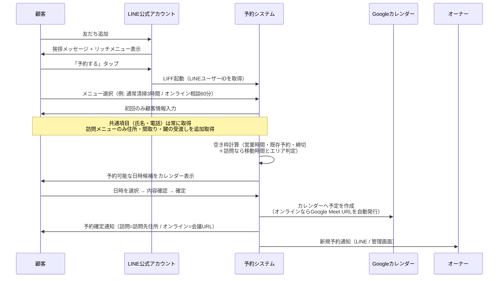
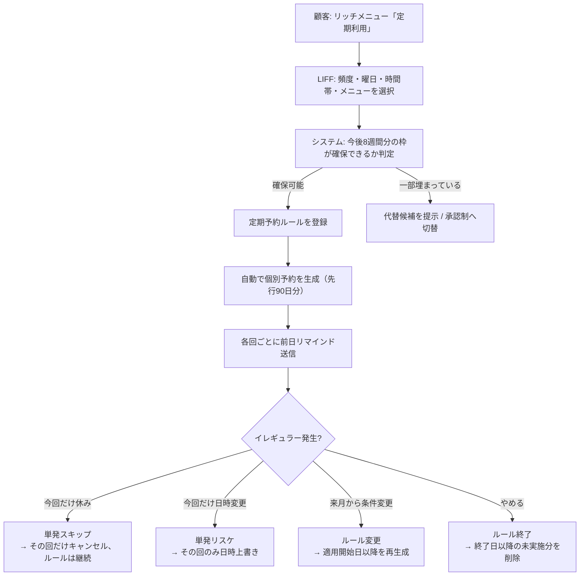
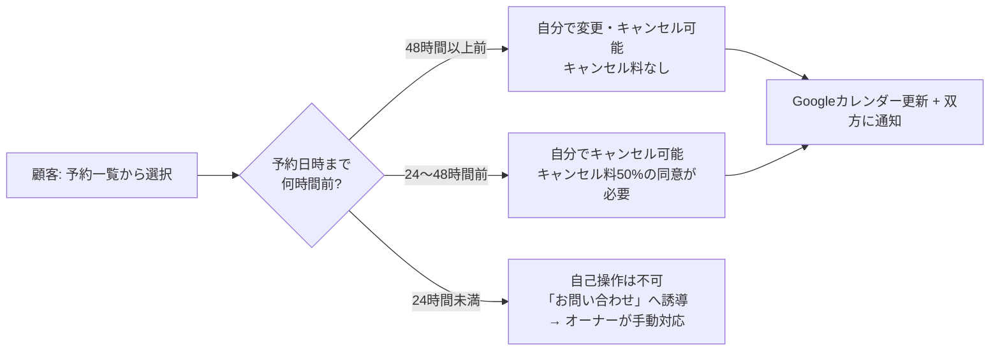
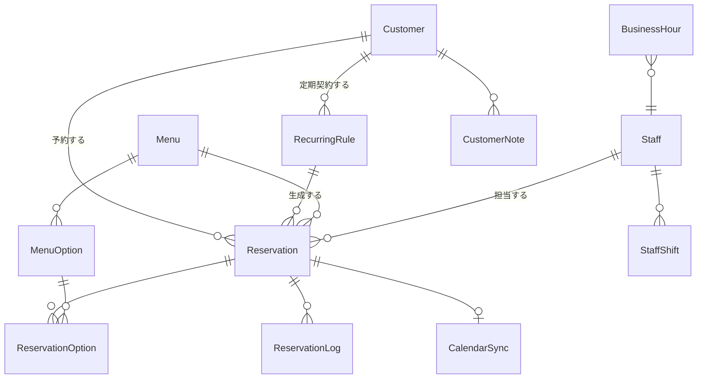
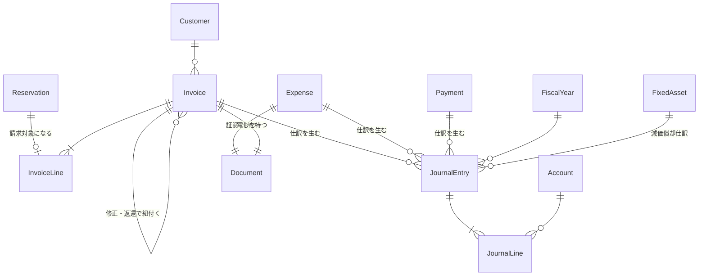
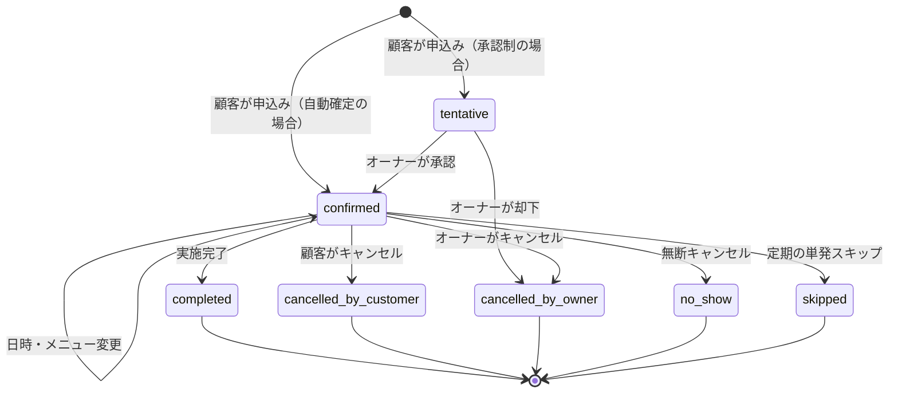

# LINE予約システム 要件定義書

**対象事業**: お掃除の家事代行 / 片付けコンサルティング
**システム名（仮）**: LINE予約システム
**版数**: v1.2
**作成日**: 2026-08-14
**更新履歴**
- v1.1 片付けコンサルのオンライン提供に対応（提供形態の概念を追加）
- v1.2 会計・インボイス機能を追加（Phase 4）。事業形態を法人、インボイス登録済みとして確定

---

## 1. プロジェクト概要

### 1.1 背景と課題

現状、家事代行・片付けコンサルの予約受付はLINEのトークでの個別やり取りが中心と想定される。この運用には以下の課題がある。

| # | 課題 | 影響 |
|---|---|---|
| 1 | 予約の受付・調整が手作業のチャット往復 | 1件あたり数往復、対応漏れ・二重予約のリスク |
| 2 | 空き状況を自分で確認して返信する必要がある | 営業時間外の問い合わせに即応できず機会損失 |
| 3 | 定期利用（毎週・隔週など）の管理が台帳・手帳ベース | 「今週だけ休み」「来月から時間変更」等のイレギュラー対応が煩雑 |
| 4 | 変更・キャンセルの連絡が口頭/チャットで記録が残りにくい | 直前キャンセルの把握、キャンセルポリシー運用が曖昧 |
| 5 | 移動時間を考慮した枠取りが属人的 | 詰め込みすぎ／空きすぎによる稼働率低下 |
| 6 | 領収書・請求書を手書き／手作業で発行している | 1件ごとに時間がかかり、**インボイスの記載要件を満たしているかの確認も毎回必要**になる |
| 7 | 売上の集計と経費の記帳が月末・決算前にまとまって発生する | 数日単位の作業が発生し、レシートの紛失や記憶違いによる計上漏れも起きる |

### 1.2 目的

1. **お客様がLINEだけで24時間、予約・変更・キャンセル・定期利用の申込みを完結できる**
2. **オーナーが管理画面とGoogleカレンダーの両方でスケジュールを一元把握できる**
3. **定期利用の「イレギュラー対応」を数クリックで処理できる**
4. **予約受付にかかる手作業をなくし、施術・コンサル本業に時間を割けるようにする**
5. **予約データがそのまま会計データになり、インボイス発行と記帳が自動で終わる状態を作る**（決算時に税理士へ渡すものが常にそろっている）

### 1.3 成功指標（KPI）

| 指標 | 現状（想定） | 目標（稼働3ヶ月後） |
|---|---|---|
| 予約1件あたりの調整往復数 | 3〜5往復 | 0往復（自動完結率80%以上） |
| 予約受付にかける事務作業時間 | 週5時間程度 | 週1時間以下 |
| 二重予約・ダブルブッキング発生件数 | 月1件程度 | 0件 |
| 無断キャンセル（No Show）率 | 5%程度 | 2%以下（前日リマインド効果） |
| 定期利用顧客の継続率 | — | 計測可能にする（ダッシュボードで可視化） |
| 領収書・請求書の発行にかかる時間 | 1件あたり5分程度 | **0分（自動発行・自動送付）** |
| 記帳・経費入力にかかる時間 | 月4時間程度（まとめて処理） | 月30分以下（レシート撮影のみ） |
| 決算前の資料準備にかかる時間 | 数日 | **1日以下（帳簿と証憑が常にそろっている状態）** |

---

## 2. スコープ

### 2.1 対象範囲（v1で作るもの）

- LINE公式アカウント上での顧客向け予約機能（LIFFアプリ + リッチメニュー + 自動通知）
- 管理者向けWeb管理画面（スケジュール管理・顧客管理・メニュー管理・設定）
- Googleカレンダーとの双方向同期
- 単発予約 / 定期予約の両方の管理と、定期予約のイレギュラー対応
- **訪問サービスとオンラインサービスの両方の予約管理**（オンラインは会議URLの自動発行と案内まで）
- **会計・インボイス機能**（Phase 4）
  - 適格請求書（インボイス）・領収書の発行とLINEでのPDF自動送付
  - 予約データからの売上の自動仕訳、入金消込、経費と証憑の管理
  - 電子帳簿保存法に対応した証憑保存
  - 仕訳帳・総勘定元帳・月次試算表の出力
  - 計算書類4表（貸借対照表・損益計算書・株主資本等変動計算書・個別注記表）の数値の集計と出力
  - 消費税の集計と税理士向けエクスポート

### 2.2 対象外（v1では作らないもの）

| 項目 | 理由 / 将来の扱い |
|---|---|
| オンラインカード決済 | 現状は現金・銀行振込のみ。**Phase 3で追加できる拡張点だけ設計に残す** |
| **法人税申告書・別表の作成** | **税理士法第52条により税理士の独占業務**。システムは申告に必要な数値と資料の出力までを担う（5.3.0） |
| **消費税申告書の作成・提出** | 同上。集計結果の出力までとする |
| **e-Taxでの電子申告** | 同上 |
| **個別の税務判断**（経費該当性、課税区分の最終判断など） | 税務相談にあたるため対象外。システムは判断材料の提示にとどめる |
| 複数店舗・複数拠点管理 | 単一事業者を前提とする |
| スタッフの給与計算・年末調整・社会保険手続き | 勤怠のみ将来対応。**役員報酬・給与は仕訳として計上できるが、計算そのものは対象外**（給与計算ソフトの領域） |
| 顧客のスマホアプリ（ネイティブ） | LINEで完結させるため不要 |
| SMS / メールでの予約受付 | LINE単一チャネルとする（メールは管理者向け通知のみ） |

### 2.3 前提条件

| 項目 | 前提 |
|---|---|
| **サービス提供形態** | **「訪問」と「オンライン」の2形態がある**。お掃除の家事代行は訪問のみ。片付けコンサルは訪問・オンラインの両方で提供する。**提供形態はメニュー単位の属性として持ち、空き枠計算・必要な顧客情報・通知内容がそれぞれ分岐する**（詳細は 5.1.4 / 5.1.2 / 5.1.7） |
| オンライン実施ツール | **Google Meet**（Googleカレンダー連携で会議URLを自動発行できるため。Zoom希望の場合は別途API連携が必要 → 12.1参照） |
| スタッフ体制 | 当面はオーナー1名。**半年以内に複数スタッフへ拡張予定のため、データ構造は最初から複数スタッフ対応で設計する**（UIはv1では1人運用に最適化し、スタッフ管理画面はPhase 2で解放） |
| **事業形態** | **法人（株式会社・合同会社）**。決算書は計算書類4表（貸借対照表・損益計算書・株主資本等変動計算書・個別注記表）を作成する。**複式簿記が必須**となる |
| **事業年度** | 決算月は設定画面で指定する（法人のため任意の月に設定可能）。要確認事項（12.1） |
| **消費税** | **適格請求書発行事業者として登録済み（登録番号あり）＝課税事業者**。課税方式（本則課税 / 簡易課税）は設定で選択する。簡易課税の場合、家事代行・コンサルは第五種事業（サービス業）に該当する想定 |
| **記帳の方針** | **経費入力・帳簿づけをこのシステム内で完結させる**（会計ソフトは併用しない）。ただし決算の最終確認と申告は税理士が行う前提とする |
| 決済 | 現金・銀行振込。システムは「金額の提示」と「入金の記録・消込」までを担う。**領収書・請求書はLINEでPDFを自動送付する** |
| LINE公式アカウント | 既存アカウントを利用、または新規開設。**Messaging APIを利用するためLINE Developersでのチャネル作成が必要** |
| 料金プラン | 通知メッセージ数に応じてLINE公式アカウントの料金プラン選定が必要（後述 12.3） |
| Googleアカウント | オーナーのGoogleカレンダーを同期先とする |
| 対応言語 | 日本語のみ |
| 対応端末 | 顧客: スマートフォン（LINEアプリ内ブラウザ）／管理: PC・タブレット・スマートフォン |

---

## 3. 登場人物（ロール）

| ロール | 説明 | 主な利用手段 |
|---|---|---|
| **顧客（一般ユーザー）** | LINE公式アカウントの友だち。予約する人 | LINEアプリ（リッチメニュー・LIFF・トーク通知） |
| **オーナー（管理者）** | 事業主。全機能にアクセス可能 | Web管理画面 / Googleカレンダー |
| **スタッフ**（Phase 2〜） | 施術担当者。自分の予定の閲覧と一部操作のみ | Web管理画面（権限制限） |
| **税理士**（Phase 4〜） | 決算・申告を担当。帳簿と証憑の**閲覧とエクスポートのみ**が可能な権限を付与する（データの改変はできない） | Web管理画面（閲覧専用アカウント） |
| **システム** | 通知の自動送信、定期予約の自動生成、同期処理、仕訳の自動生成、書類の自動発行 | バッチ / Webhook |

---

## 4. 業務フロー（To-Be）

### 4.1 新規顧客の初回予約



### 4.2 定期利用の申込みと運用



### 4.3 変更・キャンセル



> ⚠️ 上記の時間しきい値とキャンセル料率は**設定画面から変更可能**とする（初期値は仮置き。実運用のポリシーに合わせて要調整）。

---

## 5. 機能要件

### 5.1 顧客側（LINE / LIFF）

#### 5.1.1 リッチメニュー

タブ切替式（2面）を想定。**未予約者と予約保有者でメニューを出し分ける**（LINEのリッチメニューリンク機能を利用）。

**Aパターン: 初回・予約なしの人**

| ボタン | 遷移先 |
|---|---|
| はじめての方へ | サービス紹介ページ（LIFF or 外部LP） |
| 料金・メニューを見る | メニュー一覧（LIFF） |
| **予約する** | 予約フロー（LIFF） |
| 定期利用について | 定期プラン説明 → 申込み（LIFF） |
| よくある質問 | FAQ（LIFF） |
| お問い合わせ | トーク（有人対応へ切替） |

**Bパターン: 予約がある人**

| ボタン | 遷移先 |
|---|---|
| **次回の予約を確認** | 予約詳細（LIFF） |
| 予約を変更する | 変更フロー（LIFF） |
| キャンセルする | キャンセルフロー（LIFF） |
| 定期利用の管理 | 定期ルール一覧・スキップ・変更（LIFF） |
| 新しく予約する | 予約フロー（LIFF） |
| お問い合わせ | トーク |

- 管理画面からリッチメニュー画像の差し替え・ボタン領域の設定・公開/非公開の切替ができること
- リッチメニューはLINE Messaging APIで登録・切替を行い、**管理画面から再アップロードできる**こと

#### 5.1.2 顧客登録（初回のみ）

**入力は段階的に行う。** 住所や間取りはオンライン相談には不要なため、初回に全項目を求めず、**選択したメニューの提供形態に応じて必要な項目だけを聞く**。オンライン相談だけを希望する遠方の顧客が、住所入力で離脱しないようにするための設計。

| 項目 | 訪問 | オンライン | 備考 |
|---|---|---|---|
| LINEユーザーID | ○ | ○ | LIFFから自動取得（顧客の入力不要） |
| 氏名（漢字・かな） | ○ | ○ | |
| 電話番号 | ○ | ○ | 当日連絡用 / オンライン接続トラブル時の連絡用 |
| メールアドレス | △ | ○ | オンラインは会議招待の送付先として取得を推奨 |
| 個人情報の取扱いへの同意 | ○ | ○ | チェックボックス、同意日時を記録 |
| 要望・伝達事項（自由記述） | △ | △ | |
| 住所（郵便番号・都道府県・市区町村・番地・建物名） | ○ | — | 郵便番号から自動補完。**訪問可能エリア判定に使用** |
| 間取り / 広さ | ○ | △ | 所要時間の目安算出に使用（例: 1LDK / 3LDK）。オンライン相談でも任意で取得すると相談の質が上がる |
| 駐車場の有無 | △ | — | 移動計画に使用 |
| ペットの有無・アレルギー等の注意事項 | △ | — | |
| 鍵の受け渡し方法 | △ | — | 在宅 / キーボックス / 預かり |
| ビデオ通話の利用環境 | — | △ | PC / スマホ / タブレット。事前案内の出し分けに使用 |

凡例: ○=必須 / △=任意 / —=そのメニューでは聞かない

- オンライン相談のみで登録した顧客が、後から訪問メニューを予約する際は、その時点で住所等の不足項目のみを追加入力させる
- 2回目以降は入力済み情報を再利用し、変更があれば「登録情報の変更」から更新できること

#### 5.1.3 メニュー選択・予約

- カテゴリ別にメニューを表示（例: 「お掃除（訪問）」「片付けコンサル（訪問）」「片付けコンサル（オンライン）」「スポット」「初回お試し」）
- **各メニューに提供形態バッジ（🏠訪問 / 💻オンライン）を表示**し、一覧の時点で区別できるようにする
- 一覧上部に「訪問 / オンライン / すべて」の絞り込みを置く
- 各メニューの表示項目: 名称 / 提供形態 / 説明 / 所要時間 / 料金 / 画像 / オプション
- 同一内容で訪問・オンラインの両方を提供するメニューは、**形態ごとに所要時間と料金を別々に設定できる**（オンラインは移動がない分、短時間・低価格に設定できる）
- **オプション追加**（例: 換気扇クリーニング +60分 +5,000円、水回り追加など）— 選択に応じて所要時間と料金が加算される
- 所要時間はメニューの基本時間 + オプション時間 + （間取りに応じた補正）で算出
- 日付を選ぶとその日の空き時間帯が表示され、埋まっている時間は選択不可
- 予約確定前に「日時 / メニュー / オプション / 所要時間 / 合計金額 / **訪問先住所（訪問の場合）またはオンライン実施の案内（オンラインの場合）** / キャンセルポリシー」を確認画面で提示
- 確定後、LINEに予約確定メッセージ（Flex Message）を送信

#### 5.1.4 空き枠の表示ルール（重要）

空き枠は以下をすべて満たす時間帯のみ提示する。

| 条件 | 説明 |
|---|---|
| 営業時間内 | 曜日ごとの営業時間設定に収まること（例: 平日9:00-18:00、土9:00-15:00、日祝休） |
| 休業日でない | 個別休業日・臨時休業日を除外 |
| 既存予約と重複しない | 確定・仮予約の両方を考慮 |
| **移動時間バッファを確保** | 前後の予約との間に移動時間を確保。**必要な時間は前後の予約の提供形態の組み合わせで決まる**（下表参照）。将来的には住所間の距離からの自動算出を検討 |
| **対応エリア内である**（訪問のみ） | 訪問メニューは顧客住所が対応エリア内であることを確認。**オンラインメニューはエリア判定をスキップし、全国どこからでも予約可能** |
| 準備・片付けバッファ | 各予約の前後に固定バッファ（例: 前15分 / 後15分） |
| 受付締切を過ぎていない | 例: 前日18時まで／24時間前まで（設定可能） |
| 予約可能期間内 | 例: 本日から90日先まで（設定可能） |
| 1日の最大受注件数を超えない | 例: 1日3件まで（設定可能） |
| Googleカレンダーの私用予定と重複しない | 「予定あり」として登録された私用予定を自動でブロック |

- 表示粒度は30分単位（設定可能）
- 「午前 / 午後 / 夕方」の時間帯ざっくり選択にも対応（詳細時刻はシステムが割り当て）

**移動時間バッファの決定ルール（重要）**

オンラインは自宅・事務所（＝拠点）から実施するため移動が発生しない。一方、訪問とオンラインが連続する場合は拠点との往復が必要になる。この違いを吸収するため、**連続する2件の提供形態の組み合わせでバッファを決定する**。

| 前の予約 | 次の予約 | 必要なバッファ | 初期値（設定変更可） |
|---|---|---|---|
| 🏠 訪問 | 🏠 訪問 | 訪問先間の移動時間 | 60分（エリア別に上書き可） |
| 🏠 訪問 | 💻 オンライン | **訪問先から拠点への帰着時間**＋接続準備 | 60分 |
| 💻 オンライン | 🏠 訪問 | **拠点から訪問先への移動時間** | 60分 |
| 💻 オンライン | 💻 オンライン | 切替・記録の時間のみ（移動なし） | 15分 |

- この4パターンの初期値は設定画面から個別に変更できること
- 「訪問↔オンライン」のバッファは、拠点（自宅・事務所）の住所を設定に登録して基準とする
- **この設計により、オンライン相談を訪問予約の隙間に無理なく差し込めるようになり、稼働率の改善が見込める**
- 1日の最大受注件数は、**訪問とオンラインで別々に上限を設定できる**こと（例: 訪問は1日3件まで、オンラインは追加で2件まで）

#### 5.1.5 予約の確認・変更・キャンセル

- 予約一覧（今後の予定 / 過去の履歴）を表示
- 予約詳細から「変更」「キャンセル」を実行
- 変更は「日時のみ変更」「メニュー変更」の両方に対応
- **訪問 ⇄ オンラインの切替もメニュー変更として対応**（例: 当日体調不良で訪問をオンライン相談に振り替える）。切替時は所要時間・料金の差額を再計算し、会議URLの発行または破棄、訪問先住所の要否を自動で処理する
- キャンセルポリシーに応じてキャンセル料の表示と同意取得（4.3参照）
- 締切を過ぎた操作は自己完結させず、オーナーへの問い合わせに誘導
- 変更・キャンセルの結果はLINE通知 + Googleカレンダー反映 + 管理画面の履歴に記録

#### 5.1.6 定期利用

**登録**

| 設定項目 | 選択肢 |
|---|---|
| 頻度 | 毎週 / 隔週 / 4週ごと / 毎月第N曜日 / 月1回（日付指定） |
| 曜日・時刻 | 例: 毎週火曜 10:00〜 |
| メニュー | 定期用メニュー（単発より割安な料金設定が可能） |
| 開始日 | 直近の該当曜日から選択 |
| 終了条件 | 無期限 / 回数指定（例: 全12回） / 終了日指定 |

- **定期利用は訪問・オンラインの両方で登録できる**（例: 「毎週火曜10時の訪問清掃」／「毎月第2土曜のオンライン片付けフォロー」）
- ただし**1本のルールの中で訪問とオンラインを交互に行う「ハイブリッド定期」はv1では対象外**とする。実現したい場合は定期ルールを2本登録して運用する（例: 訪問=隔週火曜、オンライン=隔週火曜の裏週）。単発のイレギュラーとして「今回だけオンラインに変更」することは可能
- 登録時に**直近8回分の枠が確保できるか事前チェック**し、確保できない回がある場合は代替時刻を提案するか、オーナー承認待ちにする
- 登録後、先行90日分の個別予約を自動生成（以降は日次バッチで生成を継続）

**変更・キャンセル**

| 操作 | 挙動 |
|---|---|
| **今回だけ休む（スキップ）** | 該当回のみキャンセル。ルールと以降の予定は維持 |
| **今回だけ日時を変える（単発リスケ）** | 該当回のみ日時を上書き。以降は元の曜日・時刻のまま |
| **今回だけオンラインに変える** | 該当回のみ提供形態をオンラインに変更（会議URLを発行、所要時間・料金を再計算）。以降の回は元の形態のまま |
| **来週から条件を変える** | 適用開始日を指定してルールを変更。**過去分と実施済み分は変更しない**。適用開始日以降の未実施分を再生成 |
| **定期をやめる** | 終了日を設定。それ以降の未実施分を削除。それまでの予定は維持 |
| **一時休止** | 期間を指定して休止（例: 8/10〜8/20）。その期間の回のみ削除、再開後は自動継続 |

- 各操作について、キャンセルポリシーの適用有無を設定できること（例: 定期のスキップは3日前まで無料）

#### 5.1.7 通知（顧客向け）

| タイミング | 内容 | 形式 |
|---|---|---|
| 友だち追加時 | 挨拶 + サービス案内 + 予約導線 | Flex Message |
| 予約確定時 | 日時・メニュー・料金・キャンセルポリシー ＋ **訪問=訪問先住所と当日の流れ / オンライン=会議URLと接続方法の案内** | Flex Message |
| 予約変更時 | 変更前後の内容 | Flex Message |
| キャンセル完了時 | キャンセル内容・キャンセル料の有無 | テキスト |
| **前日リマインド** | 明日の予約内容 + 「変更・キャンセルはこちら」＋ オンラインの場合は会議URLを再掲 | Flex Message（送信時刻は設定可能、既定18:00） |
| 当日朝リマインド（任意） | 本日の訪問予定時刻 / オンライン開始時刻 | テキスト（ON/OFF設定可） |
| **オンライン開始直前リマインド** | 「まもなく開始です」＋ **会議URLのボタン**。オンラインメニューのみ送信 | Flex Message（既定15分前、時刻・ON/OFF設定可） |
| 施術・相談の完了後 | お礼 + 次回予約導線 + （任意）レビュー依頼。オンライン相談は**当日のまとめメモ・資料リンク**を添付可能 | Flex Message |
| 定期予約の翌月分確定時 | 翌月の予定一覧 | Flex Message（月次） |
| オーナー都合の日時変更時 | 変更依頼と代替候補の提示 | Flex Message |

- 通知文面は**管理画面のテンプレートから編集可能**とする（変数埋め込み: `{顧客名}` `{日時}` `{メニュー}` `{金額}` `{訪問先住所}` `{会議URL}` 等）
- **同じ通知種別でも訪問用・オンライン用でテンプレートを分けて登録できる**こと（案内すべき内容が根本的に違うため）。未設定の場合は共通テンプレートにフォールバックする
- 通知の送信結果（成功/失敗、ブロック済みユーザー）をログに残す

---

### 5.2 管理側（Web管理画面）

#### 5.2.1 ダッシュボード

- 本日の予定一覧（時刻順、顧客名・メニュー・提供形態バッジつき。**訪問は住所と次の予定までの移動時間、オンラインは会議URLへのワンタップ参加ボタンを表示**）
- 未確認の新規予約 / 変更 / キャンセルの通知
- 承認待ちの申込み（あれば）
- 今週・今月の予約件数、売上見込み、稼働率
- 定期顧客数と継続状況

#### 5.2.2 スケジュール管理（カレンダー）

- **表示**: 日 / 週 / 月 / リスト の4ビュー
- 予約はメニュー種別ごとに色分け（単発 / 定期 / 仮予約 / ブロック）し、**提供形態はアイコン（🏠 / 💻）で区別**する
- 「訪問のみ / オンラインのみ / すべて」の表示フィルタ
- **ドラッグ&ドロップで日時変更**（変更時は空き枠バリデーション + 顧客への通知確認ダイアログ）。**移動時間の判定は前後の予約の提供形態の組み合わせで再計算する**（5.1.4の表）ため、オンラインを訪問の直後に移した場合など、形態が変わる移動でも正しく警告が出ること
- 予約枠のクリックで詳細を開き、編集・キャンセル・メモ追記
- **手動での予約作成**（電話・紹介など、LINE外から入った予約の登録）
- **ブロック枠の作成**（私用・移動・研修などで予約を受け付けない時間の設定）
- 定期予約は連なりが視覚的に分かるよう表示（同一ルールにバッジ表示）

#### 5.2.3 定期予約の管理・イレギュラー対応

- 定期ルール一覧（顧客名 / 頻度 / 曜日時刻 / メニュー / 次回 / 残回数 / 状態）
- ルール詳細から、**個別回の一覧**を表示し以下を回ごとに操作:
  - この回だけ日時変更（リスケ）
  - この回だけスキップ（キャンセル）
  - この回だけメニュー・所要時間の変更（例: 大掃除で今回だけ5時間）
  - **この回だけ提供形態を変更**（訪問→オンライン、オンライン→訪問。会議URLの発行・破棄と料金の再計算を自動で行う）
  - この回だけ担当スタッフ変更（Phase 2）
  - メモの追加
- ルール自体の操作: 一時休止 / 再開 / 条件変更（適用開始日つき）/ 終了
- **祝日・年末年始の一括処理**: 指定期間の定期予約をまとめてスキップ or 前後にずらす提案
- イレギュラー操作の履歴を全件保持（誰が・いつ・何を変更したか）

#### 5.2.4 顧客管理

- 顧客一覧（氏名 / 電話 / 住所 / 最終利用日 / 累計利用回数 / 累計金額 / 定期の有無 / タグ）
- 顧客詳細:
  - 基本情報（5.1.2の項目）
  - 予約履歴（実施済み / 今後 / キャンセル履歴）
  - **カルテ・申し送り**（作業内容の記録、写真添付、次回への引き継ぎメモ）
  - 支払い状況（現金受領済 / 振込確認済 / 未収）
  - 顧客ごとのメモ（社内用、顧客には非表示）
  - タグ付け（例: VIP / ペットあり / 鍵預かり / 要注意）
- LINEトークへの個別メッセージ送信（管理画面から）
- 顧客情報のCSVエクスポート

#### 5.2.5 メニュー管理

- メニューのCRUD（名称 / カテゴリ / **提供形態（訪問 / オンライン）** / 説明 / 画像 / 基本所要時間 / 料金 / 表示順 / 公開・非公開）
- 提供形態は必須項目とし、これによって予約フローの分岐（住所入力の要否、エリア判定、移動バッファ、会議URL発行）がすべて決まる
- オプションのCRUD（名称 / 追加時間 / 追加料金 / 対象メニュー）
- **定期専用メニュー**の設定（定期割引料金）
- 間取り別の所要時間補正表（例: 〜1LDK: 基本、2LDK: +30分、3LDK以上: +60分）。**訪問メニューにのみ適用し、オンラインメニューには適用しない**
- メニュー単位の予約可否設定（例: 「初回お試し」は初回利用者のみ選択可能）

#### 5.2.6 スケジュール設定

- 曜日別の営業時間
- **提供形態ごとの受付時間帯**（例: 訪問は9:00〜18:00、オンライン相談は20:00〜22:00の夜枠も受付可）。設定しない場合は営業時間を共通で使用する
- 定休日 / 臨時休業日（期間指定可）
- **拠点（自宅・事務所）の住所** — オンラインの実施場所であり、訪問↔オンライン間の移動時間の基準点
- **移動時間バッファ（提供形態の組み合わせ別の4パターン）**、および顧客・エリアごとの上書き（5.1.4参照）
- 前後の準備・片付けバッファ
- 予約受付締切（例: 24時間前）。**提供形態ごとに別設定が可能**（オンラインは移動準備が不要なため、より直前まで受け付けられる。例: 訪問は24時間前、オンラインは3時間前）
- 予約可能期間（例: 90日先まで）
- **1日の最大受注件数（訪問 / オンラインで別枠）**、1週間の最大稼働時間
- 予約枠の粒度（15/30/60分）
- **対応可能エリア**（郵便番号・市区町村単位のホワイトリスト。範囲外は予約不可 + **オンラインメニューへの誘導** + 問い合わせ誘導）。**訪問メニューにのみ適用される**
- キャンセルポリシー（時間しきい値ごとのキャンセル料率）

#### 5.2.7 通知・LINE設定

- 通知テンプレートの編集（5.1.7の各種通知）
- リマインド送信時刻の設定
- リッチメニューの画像アップロード・タップ領域設定・切替ルール
- 一斉配信（セグメント指定: 全員 / 定期顧客 / 3ヶ月未利用者 など）
- 自動応答（営業時間外メッセージ、キーワード応答）

#### 5.2.8 売上・レポート

- 期間指定の売上集計（メニュー別 / **提供形態別（訪問・オンライン）** / 単発・定期別 / 顧客別）
- **提供形態別の稼働分析**（訪問の移動時間を含めた拘束時間 vs オンラインの実働時間、時間あたり単価の比較）— オンライン相談の採算性を判断するために有用
- 予約件数、キャンセル率、稼働率
- 新規 / リピート比率
- CSVエクスポート（会計処理用）

#### 5.2.9 スタッフ管理（Phase 2）

- スタッフのCRUD、勤務可能時間（シフト）の設定
- スタッフ別の対応可能メニュー・対応可能エリア
- 予約への担当割当（自動割当 / 手動割当）
- 権限管理（オーナー: 全権 / スタッフ: 自分の予定の閲覧と限定操作）

---

### 5.3 会計・インボイス機能

#### 5.3.0 この機能の役割と限界（最初に読むこと）

**税理士法第52条により、税務代理・税務書類の作成・税務相談は税理士の独占業務**である。したがって本システムが担う範囲を以下のとおり明確に線引きする。

| システムが行うこと | システムが行わないこと |
|---|---|
| 予約データからの売上の自動計上（仕訳の自動生成） | 法人税申告書・別表の作成 |
| 経費の記録と証憑（レシート）の保存 | 消費税申告書の作成・提出 |
| 総勘定元帳・仕訳帳・試算表の作成 | 税務署への電子申告（e-Tax送信） |
| 計算書類4表（決算書）の**数値の集計と出力** | 個別の税務判断（この支出は経費になるか等） |
| 適格請求書（インボイス）・領収書の発行と保存 | 税務調査対応 |
| 税理士へ渡す資料の自動作成 | 決算方針の決定 |

> **設計方針**: 「日々の記帳と証憑管理を自動化し、決算のときに税理士へ渡すものが全部そろっている状態を作る」ことを目標とする。決算書の数値そのものはシステムが出力するが、**最終確定と申告は税理士の確認を経る前提**とする。

**Phase 4を A / B に分ける理由**

法人の決算書は複式簿記の会計エンジンを必要とし、実質的に会計ソフト1本分の開発規模になる。一方で、**日々の負担の大半はインボイス発行と領収書管理が占めており、決算書の出力はその後でも困らない**。そのため以下のように分割し、Aだけで先に効果を出す。

| 段階 | 内容 | 効果 |
|---|---|---|
| **Phase 4-A** | インボイス・領収書の自動発行、経費と証憑の管理、電子帳簿保存法対応、売上台帳・試算表の出力 | 手書き領収書と月末の集計作業がなくなる。**税理士に渡す資料はこの段階で完成する** |
| **Phase 4-B** | 決算整理仕訳、計算書類4表の出力、消費税集計 | 決算書の下書きまでシステムで完結する |

---

#### 5.3.1 インボイス（適格請求書）の発行

**登録番号の設定と検証**

- 設定画面に**適格請求書発行事業者の登録番号**（`T` + 13桁）を登録する
- 登録時、**国税庁「適格請求書発行事業者公表システム」のWeb-API**で番号の実在と事業者名の一致を自動検証する
- 法人顧客の登録番号も顧客マスタに保持し、同じAPIで検証する（月次で再検証し、失効を検知したら管理画面に通知）

**適格請求書の記載事項（法定6項目）**

発行するPDFには以下を必ず含める。1つでも欠けると受け取った側が仕入税額控除を受けられないため、**未設定の項目があるうちは発行ボタンを押せない**バリデーションを入れる。

| # | 記載事項 | システムでの取得元 |
|---|---|---|
| 1 | 発行事業者の名称および**登録番号** | 設定（事業者情報） |
| 2 | 取引年月日 | 予約の実施日 |
| 3 | 取引内容 | メニュー名＋オプション名（軽減税率対象がある場合はその旨を明記） |
| 4 | **税率ごとに区分して合計した対価の額**および適用税率 | 明細から税率区分別に集計 |
| 5 | **税率ごとに区分した消費税額等** | 同上（端数処理は下記ルール） |
| 6 | 交付を受ける事業者の氏名または名称（宛名） | 顧客マスタの氏名／法人名 |

> **宛名について**: 小売業など不特定多数を相手にする事業は宛名不要の「適格簡易請求書」でよいが、**家事代行は予約制で相手が特定されるため、宛名入りの適格請求書を発行する設計とする**（顧客名を保持しているため追加の手間はない）。

**消費税の端数処理ルール（実装上の必須事項）**

**1つの請求書につき、税率ごとに1回だけ端数処理を行う。** 明細行ごとに端数処理して合計する実装は認められていない。この誤りは会計システムで頻出するため、計算順序を固定する（付録C参照）。

- 端数処理の方法（切捨て / 切上げ / 四捨五入）は設定で選択でき、既定は**切捨て**とする

**発行タイミング**

| タイミング | 発行される書類 | 送付方法 |
|---|---|---|
| 施術・相談の完了時 | 領収書（現金受領時）または請求書（振込の場合） | **LINEにPDFを自動送付** |
| 入金確認時（振込） | 領収書 | LINEにPDFを自動送付 |
| 月次一括（法人顧客・定期顧客向け） | 当月分をまとめた合計請求書 | LINE または メール |

- 顧客ごとに「都度発行 / 月次一括」を設定できる
- **PDFはシステム内に保存し、いつでも再送できる**（顧客が紛失した場合の再発行に対応）
- 管理画面から印刷しての手渡しにも対応

**適格返還請求書（返還インボイス）**

キャンセル料の請求、値引き、返金が発生した場合に必要となる書類。

- 返金・値引きの登録時に**自動で返還インボイスを生成**し、元の請求書と紐付ける
- **返還額が税込1万円未満の場合は交付義務が免除される**ため、システムは1万円未満を「交付任意」として扱い、発行するかどうかを選べるようにする（既定は発行する）

**修正インボイス**

- 発行済みの請求書に誤りがあった場合、**元の書類を削除せず、修正版を新たに発行して紐付ける**（訂正履歴を残すことが電子帳簿保存法の要件でもある）
- 修正理由を必須入力とし、監査ログに記録する

**写しの保存**

- 交付した適格請求書の写しは**7年間の保存義務**があるため、PDFと明細データの両方を保存し、保存期間内は削除できないようにする
- 保存済み書類は「取引年月日・取引金額・取引先」で検索できること（5.3.3の電子帳簿保存法要件と共通）

---

#### 5.3.2 売上・入金管理（仕訳の自動生成）

予約データを会計データに変換する中核部分。**オーナーが仕訳を意識せずに済むよう、取引パターンごとに自動仕訳ルールを定義する。**

| 業務上のできごと | 自動生成される仕訳 | 備考 |
|---|---|---|
| 施術・相談が完了した | （借）売掛金 / （貸）売上高・仮受消費税 | 発生主義。実施日で計上 |
| 現金を受け取った | （借）現金 / （貸）売掛金 | 完了と同時なら1本にまとめてもよい |
| 銀行振込を確認した | （借）普通預金 / （貸）売掛金 | 入金明細との消込 |
| 定期利用の料金を前払いで受け取った | （借）普通預金 / （貸）**前受金** | 各回の実施時に売上へ振り替える |
| 前払い分の1回を実施した | （借）前受金 / （貸）売上高・仮受消費税 | |
| キャンセル料を受け取った | （借）現金・普通預金 / （貸）売上高（またはキャンセル料収入） | **キャンセル料の課税区分は税理士確認が必要**（対価性の有無で判断が分かれるため、設定で切替可能にする） |
| 返金した | （借）売上高・仮受消費税 / （貸）現金・普通預金 | 返還インボイスと連動 |

- **入金消込**: 銀行口座のCSV（各行の入出金明細）を取り込み、金額と振込名義から売掛金を自動で突合する。一致しないものだけを手作業で処理する画面を用意する
- **未収金アラート**: 実施後◯日を過ぎても入金がない予約を一覧表示し、リマインドをLINEで送信できる
- 売上は**提供形態別（訪問 / オンライン）、メニュー別、単発／定期別**に集計できること（5.2.8のレポートと同じ集計軸を使う）

---

#### 5.3.3 経費・証憑の管理

**経費の入力**

- **レシート撮影 → OCR → 仕訳候補の自動生成**（日付・金額・支払先を読み取り、勘定科目を推定する）。オーナーは内容を確認して確定するだけでよい
- スマートフォンの管理画面から撮影してその場で登録できること（移動中・買い物直後の登録を想定）
- 手入力にも対応
- **定期的に発生する経費**（家賃、通信費、サブスクリプション、リース料など）は登録しておけば毎月自動計上される

**勘定科目マスタ（家事代行・コンサル業向けの初期セット）**

導入時に使える科目をあらかじめ用意しておき、ゼロから設定する手間をなくす。

| 区分 | 科目の例 |
|---|---|
| 収益 | 売上高（家事代行）、売上高（コンサル）、雑収入 |
| 売上原価・経費 | 消耗品費（洗剤・掃除用具）、旅費交通費、車両費、燃料費、駐車場代、通信費、水道光熱費、地代家賃、広告宣伝費、支払手数料、外注費、研修費、保険料、減価償却費、租税公課 |
| 法人特有 | 役員報酬、法定福利費、福利厚生費、法人税等 |
| 資産・負債 | 現金、普通預金、売掛金、前受金、未払金、未払法人税等、工具器具備品、車両運搬具 |

- 科目は追加・編集でき、各科目に**消費税区分（課税10% / 軽減8% / 非課税 / 不課税 / 対象外）と、インボイスの有無**を紐付ける

**仕入税額控除のためのインボイス区分**

経費の登録時に、受け取った領収書が適格請求書かどうかを必ず記録する。

| 区分 | 意味 | 仕入税額控除 |
|---|---|---|
| 適格請求書あり | 相手が登録事業者で、要件を満たす書類を受領 | 全額控除できる |
| 適格請求書なし | 相手が免税事業者など | 経過措置の対象。控除割合が段階的に縮小するため、**割合を設定値として持ち、集計時に自動適用する** |
| 少額特例の対象 | 税込1万円未満の課税仕入れ | 帳簿の保存のみで控除可能（適用期限と適用要件は税理士確認が必要） |

> ⚠️ 経過措置の控除割合と少額特例の適用期限は法改正で変わる。**ハードコードせず設定値として持ち、変更履歴を残す**設計とする。

**電子帳簿保存法への対応**

電子データで受け取った領収書・請求書（メール添付、Web明細、LINEでのやり取りを含む）は、**電子データのまま保存する義務**がある。以下の要件を満たす。

| 要件 | 実装 |
|---|---|
| **真実性の確保** | 保存後の訂正・削除の履歴を全件残す（物理削除を禁止し論理削除とする）。あわせて「電子取引データの訂正削除の防止に関する事務処理規程」のテンプレートを提供する |
| **可視性の確保（検索要件）** | **取引年月日・取引金額・取引先の3項目で検索**でき、日付と金額は範囲指定で検索できること。2項目以上の組み合わせ検索にも対応する |
| 見読性 | 保存データを管理画面上でディスプレイ表示・印刷できること |
| 保存期間 | 7年間（欠損金の繰越がある事業年度は10年間）。**期間内は削除操作を禁止する** |

---

#### 5.3.4 決算書の作成（Phase 4-B）

**事業年度の設定**

- 決算月を設定（法人のため任意の月に設定可能）。期首・期末日を自動計算し、**事業年度をまたぐ集計を正しく処理する**
- 過年度のデータは締めた後、修正するには「期間の再オープン」操作を必要とし、履歴を残す

**日常帳簿の出力**

| 帳簿 | 内容 |
|---|---|
| 仕訳帳 | すべての仕訳を日付順に |
| 総勘定元帳 | 勘定科目ごとの明細と残高 |
| 補助元帳 | 得意先別の売掛金明細など |
| **月次試算表** | 毎月の残高試算表。**月次で数字を見られることが経営上いちばん効く** |
| 現金出納帳・預金出納帳 | |

**決算整理仕訳**

決算時にだけ必要な仕訳を、ウィザード形式で漏れなく処理する。

| 項目 | 処理内容 |
|---|---|
| 減価償却 | 固定資産台帳（取得日・取得価額・耐用年数・償却方法）から償却額を自動計算し仕訳を生成。少額減価償却資産の特例にも対応 |
| 前受金の振替 | 期末時点で未実施の定期予約の前受分を、翌期の売上として繰り延べる |
| 未払費用・未払金の計上 | 期末までに発生し未払いの経費 |
| 貸倒引当金 | 売掛金残高に基づく繰入（適用の要否は税理士判断） |
| 法人税等の計上 | **税額の計算は税理士が行い、システムはその金額を受け取って仕訳を計上する** |

**計算書類（決算書）の出力**

法人が作成する4種類を出力する。

| 書類 | 内容 |
|---|---|
| **貸借対照表（B/S）** | 期末時点の資産・負債・純資産 |
| **損益計算書（P/L）** | 事業年度の収益・費用・当期純利益 |
| **株主資本等変動計算書** | 資本金・利益剰余金などの期中の変動 |
| **個別注記表** | 重要な会計方針など。ひな形を用意し、変更のあった項目だけ編集する形にする |

- あわせて**勘定科目内訳明細書**（売掛金・買掛金・役員報酬などの内訳）を出力する。法人税申告に必ず必要になるため、税理士に渡す資料として重要
- 出力形式: PDF（提出・保管用）／Excel（税理士との受け渡し用）
- **前期比較**を並記する（法人の決算書は前期比較の表示が求められるため）

**税理士向けエクスポート**

- 仕訳データを汎用形式（弥生・freee・マネーフォワードの各インポート形式）でCSV出力
- 証憑PDFを期間指定で一括ダウンロード（取引日・金額・取引先をファイル名に含める）

---

#### 5.3.5 消費税の集計（Phase 4-B）

インボイス登録済み＝**課税事業者**であるため、消費税の申告が必要になる。申告書の作成は行わないが、**申告に必要な数字をすべて出す**。

- **課税方式を設定で選択**する: 本則課税 / 簡易課税 / その他の特例
  - 簡易課税を選ぶ場合、家事代行・コンサルはいずれも**第五種事業（サービス業、みなし仕入率50%）**に該当する想定。ただし業務内容によって区分が変わる可能性があるため、**事業区分はメニュー単位で設定できるようにし、複数区分が混在しても集計できる**ようにする
  - どの方式が有利かの判断は税務判断にあたるため、システムは**両方式で試算した結果を並べて表示するにとどめ、選択はオーナーと税理士が行う**
- 税率区分別（10% / 軽減8% / 非課税 / 不課税）の課税売上・課税仕入れの集計
- 仕入税額控除の集計（インボイスあり / なし・経過措置適用 / 少額特例）
- 課税売上高の推移と、**基準期間の課税売上高が1,000万円・5,000万円の境目に近づいたときのアラート**（納税義務や簡易課税の適用可否に影響するため）

---

#### 5.3.6 インボイス制度の運用チェック

登録番号を取得した後に継続して必要になる実務を、システム側で取りこぼさないようにする。

- **交付漏れの検知**: 実施済みなのに請求書・領収書が未発行の予約を一覧表示する
- **記載事項の充足チェック**: 発行前に法定6項目がそろっているかを検証し、欠けていれば発行をブロックする
- **保存状況ダッシュボード**: 交付済み書類の写しの保存件数、受領した証憑のうちインボイス区分が未設定のものの件数を表示する
- **取引先の登録番号の失効監視**: 法人顧客・仕入先の登録番号を月次で再検証し、失効していれば通知する
- **登録番号の記載漏れ防止**: 事業者情報に登録番号が未設定の状態では、インボイスの発行機能を有効化しない

> 今回は**すでに登録番号を取得済み**のため新規申請の手続き支援は不要だが、登録内容の変更（本店移転・商号変更など）が生じた場合に必要な届出のチェックリストは、ヘルプとして用意しておく。

---

### 5.4 外部連携

#### 5.4.1 LINE Messaging API / LIFF

| 用途 | 仕様 |
|---|---|
| Webhook受信 | 友だち追加、ブロック、メッセージ受信、ポストバック（ボタン押下）を受信 |
| 署名検証 | `X-Line-Signature` を必ず検証し、不正リクエストを拒否 |
| メッセージ送信 | プッシュメッセージ（通知）、リプライメッセージ（応答） |
| Flex Message | 予約確定・リマインド等をカード形式で表示 |
| LIFF | 予約画面をLINE内ブラウザで表示。`liff.getIDToken()` でユーザー本人性を検証 |
| リッチメニュー | API経由で登録・切替（ユーザー単位のリンク切替に対応） |
| 冪等性 | Webhookの再送に備え、イベントIDで重複処理を防止 |

#### 5.4.2 Googleカレンダー同期

**同期方針: 予約データの「正」は本システムのDB。Googleカレンダーはミラー + 私用予定の取り込み口。**

| 方向 | 内容 |
|---|---|
| **システム → Google（書き出し）** | 予約の作成・変更・キャンセルをGoogleカレンダーのイベントに反映。イベントには顧客名・メニュー・提供形態・電話・所要時間を記載し、システムの予約詳細画面へのリンクを含める。**訪問はイベントの「場所」に訪問先住所を設定**する |
| **オンライン会議URLの自動発行** | オンラインメニューの予約時、Google Calendar APIの `conferenceData` で**Google MeetのURLを自動発行**し、イベントに紐付ける。発行されたURLは予約データに保存し、LINE通知・予約詳細・リマインドで顧客に案内する。予約キャンセル時はイベントごと削除され、URLも無効になる |
| **Google → システム（取り込み）** | オーナーがGoogleカレンダーに登録した私用予定を「ブロック枠」として取り込み、空き枠から除外する |
| 実装方式 | Google Calendar API + **Push通知（Watch API）** による差分同期。Watchの有効期限切れに備え、日次のフル差分同期をフォールバックとして実行 |
| 対象カレンダー | 業務用カレンダー（書き出し先）と、取り込み対象カレンダー（複数指定可）を設定画面で選択 |
| 競合時のルール | Googleカレンダー側で**システムが作成したイベント**が編集・削除された場合は、システム側を正としてGoogle側を復元し、管理画面に警告を表示（v1）。※Google側の編集をシステムに反映する双方向マージはv1では行わない |
| 識別 | システム作成イベントには `extendedProperties.private.reservationId` を付与して識別 |
| 認証 | OAuth 2.0（オーナーのGoogleアカウントで初回認可、リフレッシュトークンを暗号化保存） |
| 障害時 | Google API障害時も予約受付は継続。同期は失敗キューに退避し自動リトライ（指数バックオフ、最大5回）。失敗継続時は管理画面に通知 |

#### 5.4.3 将来の連携（拡張点として設計に残す）

| 連携先 | 用途 | 時期 |
|---|---|---|
| Stripe | オンライン決済、定期課金、キャンセル料の自動徴収 | Phase 3 |
| 会計ソフト（freee / マネーフォワード） | 売上データ連携 | 検討 |
| Googleマップ / 距離行列API | 住所間の実移動時間を自動算出しバッファに反映 | Phase 3 |

---

## 6. 非機能要件

| 分類 | 要件 |
|---|---|
| **性能** | LIFFの初期表示3秒以内、空き枠検索のレスポンス1秒以内。同時接続50程度を想定 |
| **可用性** | 稼働率99%以上を目標。計画メンテナンスは深夜帯に実施 |
| **拡張性** | 顧客数1,000件、年間予約数3,000件規模まで問題なく動作すること |
| **セキュリティ** | 全通信HTTPS。LINE Webhookの署名検証必須。LIFF IDトークンの検証必須。管理画面はGoogleアカウントでのログイン（許可したメールアドレスのみ）。**2要素認証はGoogleアカウント側の設定に委ねる**（自前でパスワードを持たないため、こちらでの必須化はできない。オーナーのアカウントで2段階認証をオンにしていただく運用とする） |
| **個人情報保護** | 住所・電話・鍵の受け渡し方法などの機微情報を扱う。DBの保存時暗号化、アクセスログの記録、退会時のデータ削除フローを用意。プライバシーポリシーの掲示と初回同意取得を必須とする |
| **監査ログ** | 予約の作成・変更・キャンセル・定期ルールの操作を、実行者・日時・変更前後の値つきで永続保存 |
| **バックアップ** | DBの日次自動バックアップ、7日以上の世代保持、リストア手順の文書化 |
| **障害通知** | 同期失敗・通知送信失敗・エラー率上昇をオーナーへ通知（メール or LINE） |
| **会計データの保全**（Phase 4） | 仕訳・証憑・発行済み書類は**物理削除しない（論理削除のみ）**。保存期限（7年、欠損金の繰越がある事業年度は10年）内は削除操作自体をブロックする。バックアップも同期間保持する |
| **会計データの権限**（Phase 4） | 税理士ロールは閲覧とエクスポートのみ。**締め済み事業年度の仕訳は編集不可**とし、再オープンには理由の記録を必須とする |
| **金額の精度**（Phase 4） | 金額はすべてDecimal（固定小数点）で扱い、**浮動小数点数を使わない**。消費税の端数処理は付録Cの順序に従い、自動テストで保護する |
| **タイムゾーン** | 全てAsia/Tokyoで扱う。DBはUTC保存、表示時にJST変換 |
| **ブラウザ対応** | LINE内ブラウザ（iOS/Android）、Chrome / Safari / Edge の最新2バージョン |
| **アクセシビリティ** | 文字サイズ・コントラストに配慮。50代以上の顧客も想定し、ボタンは大きく、1画面1アクションを基本とする |

---

## 7. データモデル（主要エンティティ）



### 7.1 主要テーブル定義

**Customer（顧客）**
`id` / `lineUserId`(unique) / `displayName` / `name` / `nameKana` / `phone` / `email`(null可) / `postalCode`(**null可**) / `address`(**null可**) / `buildingName` / `layout`(間取り) / `hasParking` / `hasPet` / `keyHandover` / `videoEnvironment`(pc/smartphone/tablet、null可) / `notes` / `tags[]` / `privacyConsentAt` / `status`(active/blocked/withdrawn) / `createdAt` / `updatedAt`

> オンライン相談のみの顧客は住所を持たないため、**住所系のカラムはすべてNULL許容**とする。訪問メニューを予約する時点で入力を必須化する（アプリケーション側のバリデーション）。

**Menu（メニュー）**
`id` / `category` / `name` / **`deliveryType`(visit / online)** / `description` / `imageUrl` / `durationMinutes` / `price` / `applyLayoutAdjustment`(間取り補正の適用可否) / `isRecurringOnly` / `isFirstTimeOnly` / `sortOrder` / `isPublished`

> 訪問とオンラインの両方で提供する内容は、**`deliveryType` が異なる2件のメニューとして登録する**（所要時間と料金を別々に設定できるため）。同一サービスの対を示したい場合は `pairedMenuId` で相互参照させ、UI上で「オンラインでも相談できます」の導線を出す。

**MenuOption（オプション）**
`id` / `menuId`(null可=全メニュー共通) / `name` / `additionalMinutes` / `additionalPrice` / `sortOrder` / `isPublished`

**Reservation（予約 / 定期の各回もここに実体化される）**
`id` / `customerId` / `staffId` / `menuId` / `recurringRuleId`(null可) / `occurrenceDate`(定期の本来の実施日) / `startAt` / `endAt` / `totalMinutes` / `totalPrice` / `status` / **`deliveryType`(visit / online)** / **`serviceAddress`**(訪問時の実施住所スナップショット、null可) / **`meetingUrl`**(オンライン時の会議URL、null可) / **`meetingProvider`**(google_meet / other) / `source`(line/admin/phone) / `isException`(定期からの逸脱フラグ) / `paymentStatus`(unpaid/cash_received/transfer_confirmed) / `customerNote` / `internalNote` / `cancelledAt` / `cancelReason` / `cancelFee` / `createdAt` / `updatedAt`

> **`deliveryType` と `serviceAddress` を予約側にも持たせる理由**: ①「今回だけオンラインに変更」のようにメニューの形態と実際の形態がずれるケースがあるため、②顧客が引っ越しても過去の予約の実施場所の記録が変わってはいけないため（スナップショット保存）。

`status`: `tentative`(仮) / `confirmed`(確定) / `completed`(実施済) / `cancelled_by_customer` / `cancelled_by_owner` / `no_show` / `skipped`(定期のスキップ)

**RecurringRule（定期ルール）**
`id` / `customerId` / `staffId` / `menuId` / `frequency`(weekly/biweekly/every4weeks/monthly_nth/monthly_date) / `dayOfWeek` / `nthWeek` / `dayOfMonth` / `startTime` / `durationMinutes` / `startDate` / `endDate`(null=無期限) / `totalOccurrences`(null=無期限) / `status`(active/paused/ended) / `pausedFrom` / `pausedTo` / `generatedUntil`(どこまで実体化済みか) / `createdAt`

> **設計上の要点**: 定期予約は「ルール」と「各回の実体（Reservation）」を分離する。各回を実体化しておくことで、1回だけの日時変更・スキップ・メニュー変更といったイレギュラー対応が、ルールを壊さずに扱える。ルール変更時は `generatedUntil` 以降の**未実施かつ `isException=false` の回のみ**再生成し、個別に手を入れた回（`isException=true`）は保護する。

**BusinessHour（営業時間）**
`id` / `staffId`(null=全体設定) / `dayOfWeek` / `openTime` / `closeTime` / `isClosed`

**Holiday（休業日）**
`id` / `staffId`(null=全体) / `date` / `endDate` / `reason`

**BlockedSlot（ブロック枠）**
`id` / `staffId` / `startAt` / `endAt` / `title` / `source`(manual/google) / `googleEventId`

**Staff（スタッフ）** ※Phase 2で本格利用。v1もオーナー1件を登録して運用
`id` / `name` / `email` / `role`(owner/staff) / `availableMenuIds[]` / `availableAreas[]` / **`canHandleOnline`**(オンライン相談を担当できるか) / **`baseAddress`**(そのスタッフの拠点住所) / `isActive`

**Setting（各種設定）**
`key` / `value`(JSON) — **拠点住所**、**移動時間バッファ（visit→visit / visit→online / online→visit / online→online の4パターン）**、**提供形態別の受付締切・1日の上限件数・受付時間帯**、予約可能期間、キャンセルポリシー、リマインド時刻、対応エリア等

**NotificationLog（通知ログ）**
`id` / `customerId` / `reservationId` / `type` / `sentAt` / `status` / `errorMessage`

**ReservationLog（監査ログ）**
`id` / `reservationId` / `actorType`(customer/owner/staff/system) / `actorId` / `action` / `beforeJson` / `afterJson` / `createdAt`

**CalendarSync（カレンダー同期状態）**
`id` / `reservationId` / `googleEventId` / `googleCalendarId` / `lastSyncedAt` / `syncStatus` / `retryCount`

### 7.2 会計・インボイス関連テーブル（Phase 4）



**Account（勘定科目）**
`id` / `code` / `name` / `type`(asset/liability/equity/revenue/expense) / `taxCategory`(課税10 / 軽減8 / 非課税 / 不課税 / 対象外) / `simplifiedTaxBusinessType`(簡易課税の事業区分、第一種〜第六種) / `isActive` / `sortOrder`

**JournalEntry（仕訳）** — 貸借が必ず一致すること（アプリ層とDB制約の両方で検証）
`id` / `fiscalYearId` / `entryDate` / `description` / `sourceType`(reservation/invoice/payment/expense/depreciation/adjustment/manual) / `sourceId` / `isAdjusting`(決算整理仕訳フラグ) / `isLocked`(締め済み) / `createdBy` / `createdAt`

**JournalLine（仕訳明細）**
`id` / `journalEntryId` / `accountId` / `side`(debit/credit) / `amount` / `taxCategory` / `taxAmount` / `hasQualifiedInvoice`(仕入税額控除の可否判定に使用) / `note`

**Invoice（請求書・領収書・インボイス）**
`id` / `invoiceNumber`(連番、欠番を作らない) / `type`(invoice/receipt/**returned**(適格返還請求書)/**corrected**(修正インボイス)) / `customerId` / `issueDate` / `subtotalByTaxRate`(JSON: 税率ごとの税抜合計) / `taxByTaxRate`(JSON: 税率ごとの消費税額) / `totalAmount` / `registrationNumber`(発行時点の自社登録番号のスナップショット) / `recipientName`(発行時点の宛名スナップショット) / `relatedInvoiceId`(修正元・返還元) / `pdfDocumentId` / `sentAt` / `sentVia`(line/email/print) / `status`(draft/issued/sent/void) / `createdAt`

> **スナップショットで持つ理由**: 登録番号や宛名は後から変わりうるが、**一度交付した書類の記載内容は変わってはいけない**。発行時点の値を固定して保存する。

**InvoiceLine（請求明細）**
`id` / `invoiceId` / `reservationId`(null可) / `description` / `quantity` / `unitPrice` / `taxRate`(10/8/0) / `isReducedTaxRate`(軽減税率対象である旨の表示) / `amount`

**Payment（入金）**
`id` / `customerId` / `invoiceId`(null可) / `paidAt` / `amount` / `method`(cash/bank_transfer) / `bankTransactionId`(消込元の明細) / `status`(unmatched/matched) / `note`

**Expense（経費）**
`id` / `expenseDate` / `accountId` / `amount` / `taxCategory` / `vendorName` / `vendorRegistrationNumber`(相手の登録番号、null可) / **`invoiceStatus`**(qualified / non_qualified / small_amount_exception) / `documentId` / `isRecurring` / `recurringRuleId` / `ocrRawText` / `note`

**Document（証憑）** — 電子帳簿保存法の保存対象
`id` / `fileUrl` / `fileHash`(改ざん検知用) / **`transactionDate`** / **`transactionAmount`** / **`counterpartyName`** / `documentType`(issued_invoice/received_receipt/received_invoice/bank_statement) / `retentionUntil`(保存期限。この日まで削除禁止) / `uploadedAt` / `deletedAt`(論理削除のみ)

> **太字の3項目は電子帳簿保存法の検索要件**（取引年月日・取引金額・取引先）にそのまま対応する。この3列にインデックスを張り、日付と金額は範囲検索、3項目は組み合わせ検索ができるようにする。

**DocumentAuditLog（証憑の訂正・削除履歴）** — 真実性の確保要件
`id` / `documentId` / `action`(create/update/logical_delete/restore) / `beforeJson` / `afterJson` / `reason` / `actorId` / `createdAt`

**FiscalYear（事業年度）**
`id` / `name`(例: 第3期) / `startDate` / `endDate` / `status`(open/closing/closed) / `closedAt`

**FixedAsset（固定資産台帳）**
`id` / `name` / `acquisitionDate` / `acquisitionCost` / `accountId` / `usefulLife`(耐用年数) / `depreciationMethod`(定額法/定率法) / `accumulatedDepreciation` / `bookValue` / `isSmallAmountSpecial`(少額減価償却資産の特例適用) / `disposedAt`

**TaxSetting（消費税設定）**
`id` / `fiscalYearId` / `method`(honsoku/kani/special) / `simplifiedBusinessType` / `roundingMode`(floor/ceil/round) / `transitionalDeductionRate`(インボイスなし仕入れの控除割合) / `smallAmountExceptionEnabled` / `note`

> 税制は改正される。**控除割合や特例の適用可否はコードに埋め込まず、事業年度ごとの設定として持つ。**

---

## 8. 画面一覧

### 8.1 顧客側（LIFF）

| # | 画面 | 概要 |
|---|---|---|
| C-01 | サービス紹介 | 事業内容・実績・料金の概要 |
| C-02 | 初回顧客登録 | 個人情報同意 + 共通項目の入力。**訪問メニューを選んだ場合のみ住所・間取り等を追加で入力** |
| C-03 | メニュー一覧 | カテゴリ別のメニューカード。**訪問 / オンラインの絞り込みと形態バッジ** |
| C-04 | メニュー詳細・オプション選択 | 所要時間・料金の自動計算 |
| C-05 | 日時選択（カレンダー） | 月表示 → 日別の空き時間帯 |
| C-06 | 予約内容確認 | 最終確認 + キャンセルポリシー同意 |
| C-07 | 予約完了 | 完了メッセージ + カレンダー追加導線 + **オンラインの場合は会議URLと接続方法の案内** |
| C-08 | 予約一覧（今後 / 履歴） | ステータス別 |
| C-09 | 予約詳細 | 変更・キャンセル導線 |
| C-10 | 予約変更 | 日時・メニューの変更 |
| C-11 | キャンセル確認 | キャンセル料の提示と同意 |
| C-12 | 定期利用の申込み | 頻度・曜日・時刻・開始日の設定 |
| C-13 | 定期ルール一覧・詳細 | 次回以降の予定表示 |
| C-14 | 定期のスキップ / リスケ / 変更 / 解約 | 各回操作とルール操作 |
| C-15 | 登録情報の変更 | 住所・電話等の更新 |
| C-16 | FAQ | よくある質問 |
| C-17 | 領収書・請求書の確認（Phase 4） | 発行済み書類の一覧とPDFの再取得。紛失時の再発行依頼が不要になる |

### 8.2 管理側（Web）

| # | 画面 | 概要 |
|---|---|---|
| A-01 | ログイン（Googleアカウント） | |
| A-02 | ダッシュボード | 本日の予定・未読通知・KPI |
| A-03 | カレンダー（日/週/月/リスト） | D&Dでのリスケ、ブロック枠作成 |
| A-04 | 予約詳細・編集 | ステータス変更、メモ、支払い記録 |
| A-05 | 予約の新規手動登録 | 電話予約等の登録 |
| A-06 | 定期ルール一覧 | 状態別フィルタ |
| A-07 | 定期ルール詳細（各回一覧） | 回ごとのイレギュラー操作 |
| A-08 | 顧客一覧 | 検索・タグ絞り込み |
| A-09 | 顧客詳細（カルテ含む） | 履歴・メモ・写真 |
| A-10 | メニュー・オプション管理 | |
| A-11 | スケジュール設定 | 営業時間・休業日・拠点住所・**提供形態別のバッファ4パターン**・締切・エリア |
| A-12 | キャンセルポリシー設定 | |
| A-13 | 通知テンプレート管理 | |
| A-14 | リッチメニュー管理 | 画像アップロード・領域設定・切替 |
| A-15 | 一斉配信 | セグメント配信 |
| A-16 | 売上・レポート | 集計・CSV出力 |
| A-17 | Googleカレンダー連携設定 | 認可・対象カレンダー選択・同期状況 |
| A-18 | スタッフ管理（Phase 2） | シフト・権限 |
| A-19 | 操作ログ | 監査証跡 |

**会計・インボイス（Phase 4）**

| # | 画面 | 段階 | 概要 |
|---|---|---|---|
| A-20 | 事業者情報・インボイス設定 | 4-A | 登録番号の登録と国税庁APIによる検証、端数処理、発行タイミング |
| A-21 | 請求書・領収書の一覧 | 4-A | 発行状況、未交付の抽出、再送 |
| A-22 | 請求書の発行・編集 | 4-A | 法定6項目の充足チェック、PDFプレビュー |
| A-23 | 返還インボイス / 修正インボイスの発行 | 4-A | 元書類との紐付け、理由の記録 |
| A-24 | 入金管理・消込 | 4-A | 銀行CSV取込、自動突合、未収金アラート |
| A-25 | 経費登録（レシート撮影） | 4-A | スマホ対応。OCR結果の確認と確定 |
| A-26 | 経費一覧 | 4-A | インボイス区分の未設定抽出 |
| A-27 | 証憑ボックス | 4-A | **取引年月日・金額・取引先での検索**（電帳法の検索要件） |
| A-28 | 勘定科目マスタ | 4-A | 科目と消費税区分の管理 |
| A-29 | 売上台帳・月次試算表 | 4-A | 税理士に渡す資料はここまでで完成する |
| A-30 | 仕訳帳・総勘定元帳 | 4-B | 検索・修正・履歴 |
| A-31 | 決算整理ウィザード | 4-B | 減価償却・前受金振替・未払計上を順に処理 |
| A-32 | 固定資産台帳 | 4-B | 償却計算 |
| A-33 | 決算書（計算書類4表）出力 | 4-B | 前期比較つき。PDF / Excel |
| A-34 | 勘定科目内訳明細書 | 4-B | 申告用の内訳資料 |
| A-35 | 消費税集計 | 4-B | 本則・簡易の試算比較、税率区分別集計 |
| A-36 | 税理士向けエクスポート | 4-B | 仕訳CSV、証憑の一括ダウンロード |
| A-37 | 事業年度・締め管理 | 4-B | 月次締め、期末締め、再オープンの履歴 |

---

## 9. 技術構成（提案）

| 層 | 技術 | 選定理由 |
|---|---|---|
| フロントエンド（LIFF / 管理画面） | **Next.js (App Router) + TypeScript + Tailwind CSS** | LIFFと管理画面を1つのコードベースで管理でき、SSRで初期表示が速い |
| UIコンポーネント | shadcn/ui | 管理画面のフォーム・テーブルを短期間で構築 |
| カレンダーUI | FullCalendar | D&Dリスケ、週/月表示に標準対応 |
| バックエンド | Next.js Route Handlers（API） | 構成をシンプルに保つ |
| データベース | **PostgreSQL**（Supabase または Neon） | リレーション・トランザクションが必要。時刻範囲の重複判定に強い |
| ORM | Prisma | 型安全なスキーマ管理とマイグレーション |
| 認証（管理画面） | Auth.js（NextAuth）+ Googleアカウント | パスワードを自前で持たない。2要素認証はGoogle側の設定を使う |
| ホスティング | **Vercel** | Next.jsとの親和性、デプロイの容易さ |
| バッチ処理 | Vercel Cron（日次: 定期予約の生成 / リマインド送信 / カレンダー差分同期） | |
| 外部API | LINE Messaging API SDK、LIFF v2、Google Calendar API v3 | |
| 画像保存 | Vercel Blob または Supabase Storage | メニュー画像・カルテ写真 |
| エラー監視 | Sentry | |
| **金額の計算** | **Decimal型（Prisma Decimal / PostgreSQL numeric）** | **消費税計算で浮動小数点数を使わない。** 円未満の誤差が申告額のずれに直結するため必須 |
| PDF生成 | @react-pdf/renderer または Puppeteer | 請求書・領収書・決算書の出力。**日本語フォントの埋め込みが必要**（未埋め込みだと文字化けする） |
| レシートOCR | Google Cloud Vision API | 日本語レシートの読み取り精度が高い。1,000枚/月で数百円程度 |
| 証憑ストレージ | S3互換ストレージ（**バージョニングとオブジェクトロックを有効化**） | 電子帳簿保存法の真実性要件。保存期限内の物理削除を仕組みで防ぐ |
| 登録番号の検証 | 国税庁「適格請求書発行事業者公表システム」Web-API | 利用に事前の申請（アプリケーションID取得）が必要 |

> ※上記は推奨構成です。既にお使いのサーバーや希望技術があれば合わせて調整します。

---

## 10. 開発フェーズと想定スケジュール

| フェーズ | 内容 | 想定期間 |
|---|---|---|
| **Phase 0: 準備** | LINE公式アカウント/Messaging APIチャネル開設、Google Cloudプロジェクト作成、ドメイン・環境準備、メニューと料金の確定、キャンセルポリシー確定 | 1週間 |
| **Phase 1: MVP** | 顧客登録（形態別の段階入力）/ メニュー選択 / **訪問・オンライン両対応の単発予約**・変更・キャンセル / **Google Meet URLの自動発行** / **提供形態別の移動バッファ計算** / リッチメニュー / 予約確定・リマインド通知 / 管理画面のカレンダーと予約管理 / Googleカレンダー同期 | 5〜6週間 |
| **Phase 2: 定期予約 + 運用強化** | 定期利用の登録・変更・スキップ・解約 / イレギュラー対応 / 顧客カルテ / 売上レポート / 一斉配信 / スタッフ管理の解放 | 3〜4週間 |
| **Phase 3: 拡張** | オンライン決済（Stripe）/ 距離ベースの移動時間自動算出 / レビュー依頼 | 別途 |
| **Phase 4-A: インボイスと証憑管理** | 事業者情報・登録番号の設定と検証 / **適格請求書・領収書の発行とLINEでのPDF自動送付** / 返還・修正インボイス / 入金消込 / **経費登録（レシートOCR）** / 勘定科目マスタ / **電子帳簿保存法対応の証憑保存** / 売上台帳・月次試算表 | 4〜5週間 |
| **Phase 4-B: 決算書出力** | 複式簿記の会計エンジン（仕訳帳・総勘定元帳）/ 決算整理ウィザード / 固定資産台帳 / **計算書類4表の出力** / 勘定科目内訳明細書 / 消費税集計 / 税理士向けエクスポート | 6〜8週間 |

**Phase 4の分割について**: 4-Aだけでも**手書き領収書と月末の集計作業はなくなり、税理士に渡す資料は完成します**。決算書の出力（4-B）は会計エンジンそのものの実装となり工数が跳ね上がるため、4-Aを先に本番投入して実務での効果を確認してから着手することを強く推奨します。

**Phase 0で追加が必要な準備（会計まわり）**

| 項目 | 内容 |
|---|---|
| 事業者情報 | 商号、本店所在地、**適格請求書発行事業者の登録番号**、決算月 |
| 国税庁Web-API | 登録番号検証APIのアプリケーションID取得 |
| 勘定科目 | 現在使用中の勘定科目一覧（税理士から入手） |
| **期首残高** | 既に事業を行っているため、**導入時点の各勘定科目の残高（現金・預金・売掛金・固定資産など）を移行する必要がある**。前期の決算書と固定資産台帳を税理士から入手する |
| 導入タイミング | **期首（事業年度の開始日）から使い始めるのが最も移行が楽**。期の途中から始める場合は、その時点までの累計を初期データとして登録する |

**運用開始の目安**: Phase 1完了時点でLINEからの単発予約受付を開始し、定期利用は当面手動運用と並行 → Phase 2完了後に完全移行。会計機能（Phase 4-A）は**次の期首に合わせて切り替える**のが移行コストの面で有利です。

---

## 11. リスクと対策

| # | リスク | 影響 | 対策 |
|---|---|---|---|
| 1 | Googleカレンダー側で予定を直接編集し、システムと不整合 | ダブルブッキング | システム側を正とし、Google側の編集を検知して復元 + 警告表示。運用ルールとして「予約の変更は管理画面から」を徹底 |
| 2 | 移動時間を一律固定にすると、遠方案件で移動が間に合わない | 遅刻・信用低下 | エリア別にバッファを設定できるようにする。Phase 3で距離ベース自動算出 |
| 3 | LINEの通知数がプラン上限を超過 | 追加課金 | リマインド等の送信数を試算し適切なプランを選択（12.3）。管理画面に月間送信数の表示 |
| 4 | 定期予約のルール変更で過去分まで書き換わる | 実績データの破壊 | 実施済み・個別変更済みの回は再生成対象から除外する設計とする |
| 5 | 顧客がLINEをブロック → 通知が届かない | 無断キャンセル | ブロック検知時に管理画面で警告表示、電話での連絡を促す |
| 6 | 住所・鍵情報の漏洩 | 重大 | 保存時暗号化、アクセスログ、権限分離、Googleアカウントの2段階認証 |
| 7 | 直前キャンセルの多発 | 売上減 | キャンセルポリシーの明示と同意取得、Phase 3で事前決済導入 |
| 8 | 対応エリア外からの予約 | 対応不可 | 郵便番号によるエリア判定で予約前にブロックし、**オンライン相談メニューへ誘導する**（機会損失を売上に変える） |
| 9 | オンライン相談当日の接続トラブル | 相談が実施できない | 予約確定時・前日・15分前に会議URLを再送。電話番号を必須取得し、接続できない場合は電話に切替える運用。接続テスト手順をFAQに掲載 |
| 10 | 会議URLの使い回し・第三者の参加 | 自宅の様子や写真など機微な相談内容の漏洩 | **予約ごとに個別URLを発行し使い回さない**。Google Meetの参加承認（主催者の許可制）を有効化。キャンセル時はイベントごと削除しURLを無効化 |
| 11 | 単価の低いオンライン枠が、単価の高い訪問枠を圧迫する | 売上減 | 提供形態ごとに1日の上限件数を設定。オンライン専用の受付時間帯（夜枠など）を設けて訪問と棲み分ける |
| 12 | 訪問の直後にオンラインを入れ、拠点に戻れない | 遅刻・実施不可 | 「訪問→オンライン」の移動バッファを独立して設定し、空き枠計算とD&Dリスケの両方で必ず検証する（5.1.4） |

**会計・インボイス関連（Phase 4）**

| # | リスク | 影響 | 対策 |
|---|---|---|---|
| 13 | **消費税の端数処理を明細行ごとに行ってしまう** | 交付したインボイスが要件を満たさず、**受け取った顧客が仕入税額控除を受けられない**。信用問題に直結する | 税率区分ごとに1回だけ端数処理する計算順序を実装で固定し、自動テストで検証する（付録C） |
| 14 | **金額計算に浮動小数点数を使う** | 1円単位のずれが積み上がり、帳簿と申告額が合わなくなる | Decimal型を全面採用し、DBもnumericで保持する |
| 15 | 発行済み書類の内容が後から変わる | 顧客の手元にある書類と控えが不一致になり、税務調査で問題になる | 登録番号・宛名・金額は**発行時点のスナップショット**で保存。訂正は修正インボイスの発行で行い、元書類は削除しない |
| 16 | 証憑データを削除・改変してしまう | 電子帳簿保存法の要件違反 | 物理削除を禁止し論理削除のみとする。保存期限内は削除操作自体をブロックし、ストレージ側でもオブジェクトロックをかける |
| 17 | 請求書番号に欠番が生じる | 帳簿の連続性が失われ、説明を求められる | 番号は採番テーブルで排他制御して発行する。取り消しは**欠番にせず「無効」ステータス**で残す |
| 18 | 税制改正で経過措置の控除割合や特例の期限が変わる | 集計結果が誤る | 税率・控除割合・特例を**事業年度ごとの設定値**として保持し、改正時は設定変更だけで対応できるようにする |
| 19 | システムの帳簿と税理士の認識がずれる | 決算作業が二度手間になり、かえって工数が増える | 導入前に**勘定科目と自動仕訳ルールを税理士とすり合わせる**。税理士に閲覧専用アカウントを発行し、期末ではなく期中から数字を見てもらう |
| 20 | 会計機能の不具合が予約機能を巻き込む | 予約受付が止まり売上機会を失う | 会計モジュールを独立させ、**障害時も予約機能は継続する**。売上仕訳は非同期で生成し、失敗時はキューでリトライする |
| 21 | 期首残高の移行を誤る | 貸借対照表が最初から合わない | 前期の決算書と固定資産台帳をもとに移行し、**移行直後に貸借一致と各残高の突合を税理士に確認してもらう**工程を必ず入れる |

---

## 12. 確認事項・今後決めること

### 12.1 事業ルールの確定が必要な項目

| # | 項目 | なぜ必要か |
|---|---|---|
| 1 | **メニューと料金の一覧**（名称・所要時間・価格・オプション） | 予約画面の中身そのもの |
| 2 | **営業時間・定休日** | 空き枠計算の前提 |
| 3 | **対応可能エリア**（市区町村 or 郵便番号） | エリア外予約のブロック判定 |
| 4 | **移動時間バッファの目安**（例: 60分） | 枠の詰め方が変わる |
| 5 | **1日の最大受注件数** | 稼働の上限 |
| 6 | **予約受付締切**（例: 前日18時 / 24時間前） | 直前予約の可否 |
| 7 | **キャンセルポリシー**（何時間前まで無料か、キャンセル料率） | 顧客への提示文と自動判定 |
| 8 | **定期利用の割引の有無と料率** | 定期メニューの料金設定 |
| 9 | **定期のスキップは何日前まで無料か** | イレギュラー対応のルール |
| 10 | 初回のヒアリング・見積りが必要な業務があるか | 「見積り相談」フローの要否 |

**オンライン対応にともなって確定が必要な項目**

| # | 項目 | なぜ必要か |
|---|---|---|
| 11 | **オンライン相談のメニュー・所要時間・料金**（訪問版とは別に設定） | オンライン用メニューの登録内容 |
| 12 | **オンラインの受付時間帯**（訪問と同じか、夜間・土日にも広げるか） | 空き枠計算。夜枠を設けると遠方顧客・共働き世帯を取り込める |
| 13 | **使用ツールはGoogle Meetでよいか**（Zoom希望なら別途API連携が必要） | v1はGoogle Meet前提で設計。Zoomの場合は工数が数日増加 |
| 14 | **拠点（自宅・事務所）の住所** と、そこから訪問先までの平均移動時間 | 「訪問↔オンライン」のバッファの基準値 |
| 15 | **オンラインは全国対応でよいか**（エリア制限をかけないか） | エリア判定のスキップ可否 |
| 16 | オンライン相談の定期利用（月1回のフォローなど）を商品化するか | 定期メニューの設計 |
| 17 | オンライン相談後の資料・まとめメモを送る運用にするか | 完了後通知のテンプレートと添付機能の要否 |

**会計・インボイス対応にともなって確定が必要な項目**

| # | 項目 | なぜ必要か |
|---|---|---|
| 18 | **決算月**（事業年度の期首・期末） | 会計機能の全期間集計の前提。導入タイミングの判断にも直結する |
| 19 | **適格請求書発行事業者の登録番号**（T+13桁）と、登録している商号・所在地 | 発行する全書類に記載される。国税庁APIでの検証にも使用 |
| 20 | **消費税の課税方式**（本則課税 / 簡易課税）と、簡易課税の場合の事業区分 | 集計ロジックが変わる。**税理士の確認が必要** |
| 21 | **現在使用中の勘定科目一覧** | 税理士と帳簿の科目をそろえるため。税理士から入手する |
| 22 | **前期の決算書と固定資産台帳** | 期首残高の移行に必要 |
| 23 | 会計機能をいつから使い始めるか（次の期首か、期の途中か） | 期首開始なら移行がほぼ不要。期中開始ならその時点までの累計登録が必要 |
| 24 | **キャンセル料の消費税の取扱い**（課税か不課税か） | 対価性の有無で判断が分かれる。**税理士の確認が必要**。システムは設定で切り替えられるようにする |
| 25 | 領収書に**印影（角印）**を入れるか、また書式の指定があるか | PDFテンプレートの設計 |
| 26 | 請求書番号の付番ルール（例: `2026-0001`、期ごとにリセットするか） | 採番ロジック |
| 27 | 法人顧客に**月次一括請求**を行うか（締め日と支払期日） | 月次一括請求機能の要否 |
| 28 | 顧問税理士がいるか、いる場合に閲覧専用アカウントを発行するか | 税理士ロールの要否と、仕訳ルールのすり合わせ相手 |

### 12.2 アカウント・環境の準備

- LINE公式アカウント（既存があればアカウントID。なければ新規開設）
- LINE Developersアカウント（Messaging APIチャネル + LIFFアプリの作成）
- Googleアカウント（同期先のカレンダー）
- 独自ドメイン（LIFFのエンドポイントURL用。なくても開始は可能）
- プライバシーポリシー・利用規約の文面

### 12.3 想定ランニングコスト（月額・概算）

| 項目 | 概算 | 備考 |
|---|---|---|
| LINE公式アカウント | 0円 〜 5,500円 | コミュニケーションプラン（月200通まで無料）／ライトプラン5,000通/月 5,500円。**顧客50名・月4通の通知で200通、100名なら400通** → 顧客数に応じてライトプラン以上が必要 |
| ホスティング（Vercel） | 0円 〜 3,000円程度 | 個人利用規模ならHobbyでも可、業務利用はProを推奨 |
| データベース | 0円 〜 4,000円程度 | Supabase / Neonの無料枠で開始可能 |
| Google Calendar API | 0円 | 無料枠内 |
| Google Meet | 0円 〜 1,000円程度 | 無料のGoogleアカウントでも**1対1なら最大24時間**利用可能。3人以上の会議は60分で切断されるため、家族同席のコンサルを想定する場合は Google Workspace Business Starter（1ユーザー約1,000円/月）を推奨 |
| レシートOCR（Cloud Vision API）※Phase 4 | 0円 〜 300円程度 | 月1,000枚程度なら無料枠〜数百円 |
| 証憑ストレージ ※Phase 4 | 0円 〜 1,000円程度 | **7年保存のため年々増える**。PDF・レシート画像で年間数GB想定 |
| ドメイン | 年1,500円程度 | |
| **合計** | **月0円〜14,500円程度** | 稼働初期は無料枠中心で開始可能。**会計ソフトの月額（年2〜5万円程度）が不要になる分は相殺される** |

---

## 13. 用語定義

| 用語 | 定義 |
|---|---|
| **LIFF** | LINE Front-end Framework。LINEアプリ内で動くWebアプリ。ユーザーIDを取得でき、ログイン不要で本人特定ができる |
| **リッチメニュー** | LINEトーク画面下部に固定表示されるメニュー画像。タップ領域ごとに動作を設定できる |
| **Flex Message** | 画像・ボタン・レイアウトを自由に組めるLINEのカード型メッセージ |
| **定期ルール** | 「毎週火曜10時」のような繰り返しの定義そのもの |
| **各回（オカレンス）** | 定期ルールから生成された、実際の1回分の予約 |
| **イレギュラー対応** | 定期ルールはそのままに、特定の回だけ日時・内容を変えたりスキップしたりすること |
| **提供形態** | そのサービスを「訪問」で行うか「オンライン」で行うかの区分。メニューと予約の両方が持つ属性で、必要な顧客情報・移動時間・通知内容・エリア判定がこれによって分岐する |
| **拠点** | オーナーがオンライン相談を実施する場所（自宅・事務所）。訪問先との往復時間を計算する基準点になる |
| **ブロック枠** | 予約を受け付けない時間帯（私用・移動・研修など） |
| **仮予約** | 顧客が申込みしたがオーナー承認待ちの状態 |
| **適格請求書（インボイス）** | 登録番号など法定6項目を記載した請求書。これを受け取らないと、受け取った側は支払った消費税を控除できない |
| **適格返還請求書（返還インボイス）** | 返金・値引き・キャンセル料の返還時に交付する書類。税込1万円未満は交付義務が免除される |
| **修正インボイス** | 発行済みインボイスに誤りがあった場合に交付し直す書類。元の書類は削除せず残す |
| **仕入税額控除** | 売上で預かった消費税から、仕入・経費で支払った消費税を差し引くこと。インボイスがないと原則できない |
| **電子帳簿保存法（電帳法）** | 帳簿や証憑を電子データで保存する際のルール。電子で受け取った領収書は電子のまま保存する義務がある |
| **仕訳** | 取引を借方・貸方の勘定科目に振り分けた記録。複式簿記の最小単位 |
| **試算表** | 全勘定科目の残高を一覧にしたもの。貸借が一致していれば記帳に大きな誤りがないと確認できる |
| **前受金** | 先にお金を受け取ったが、まだサービスを提供していない分。売上ではなく負債として扱う |
| **決算整理仕訳** | 決算のときだけ行う仕訳（減価償却、前受金の振替、未払費用の計上など） |
| **計算書類** | 法人が作成する決算書類の総称。貸借対照表・損益計算書・株主資本等変動計算書・個別注記表の4種類 |

---

## 付録A: 予約ステータスの遷移



## 付録B: 定期ルール変更時の再生成ロジック（擬似コード）

```
ルール変更(ruleId, 新条件, 適用開始日):
    # 1. 保護対象を確定する
    保護対象 = 該当ルールの予約のうち、以下のいずれか
        - 実施済み (status = completed)
        - 適用開始日より前
        - 個別に変更済み (isException = true)

    # 2. 再生成対象を削除
    削除対象 = 該当ルールの予約 - 保護対象 かつ status in (confirmed, tentative)
    各削除対象について:
        Googleカレンダーのイベントを削除
        予約を論理削除し、監査ログに記録

    # 3. 新条件で再生成
    ルールの条件を新条件で更新
    生成期間 = 適用開始日 〜 min(ルール終了日, 本日+90日)
    各該当日時について:
        空き枠チェック（既存予約・ブロック枠・休業日と衝突しないか）
        　　※前後の予約との必要バッファは、両者の提供形態の組み合わせで決定する（5.1.4）
        衝突なし → 予約を作成、Googleカレンダーへ書き出し
        　　　　　（オンラインメニューならMeet URLを発行して予約に紐付け）
        衝突あり → 「要調整」リストに追加（管理画面で通知、オーナーが手動調整）

    # 4. 顧客へ通知
    変更後の直近の予定一覧をLINEで送信
```

## 付録C: 消費税の計算と請求書生成ロジック

### C-1. 価格の持ち方（総額表示義務への対応）

消費者向けに価格を表示する場合は**総額表示（税込価格の表示）が義務**づけられている。したがって、

- **メニューの料金は「税込価格」で登録する**（顧客に見える金額と請求額が一致し、混乱がない）
- 請求書の発行時に、**税込金額から税率区分ごとに消費税額を逆算**して内訳を表示する
- データベースには税込単価を保持し、税抜金額と消費税額は請求書生成時に算出した結果を保存する

### C-2. 端数処理の必須ルール

**1つの請求書につき、税率ごとに1回だけ端数処理を行う。** 明細行ごとに端数処理をして合計する実装は認められていない。

```
【誤り】明細行ごとに端数処理してから合計する
  行1: 13,580円(税込) → 消費税 1,234.54… → 1,234円
  行2:  4,980円(税込) → 消費税   452.72… →   452円
  消費税合計 = 1,686円   ← 認められない計算方法

【正しい】税率ごとに合計してから1回だけ端数処理する
  10%対象の税込合計 = 13,580 + 4,980 = 18,560円
  消費税額 = 18,560 × 10 / 110 = 1,687.27… → 切捨て → 1,687円
  税抜合計 = 18,560 - 1,687 = 16,873円
```

同じ取引でも計算方法によって1円ずれる。**このずれが積み上がると帳簿と申告額が合わなくなるため、計算順序を実装で固定し、自動テストで保護する。**

### C-3. 請求書生成の擬似コード

```
請求書を生成する(顧客, 対象予約リスト, 発行日):

    # 1. 明細を作る（この時点では端数処理をしない）
    明細リスト = []
    各予約について:
        明細リスト.追加({
            内容: メニュー名 + オプション名,
            取引年月日: 予約の実施日,
            税込金額: 予約の合計金額,
            税率: メニューの税率区分,        # 家事代行は原則10%
            軽減税率対象か: false
        })

    # 2. 税率ごとにグループ化して合計する
    税率別合計 = 明細リスト を 税率でグループ化し、税込金額を合計

    # 3. ★税率ごとに1回だけ端数処理する★
    税率別消費税 = {}
    税率別税抜   = {}
    各(税率, 税込合計) について:
        生の消費税 = 税込合計 × 税率 / (100 + 税率)
        税率別消費税[税率] = 端数処理(生の消費税, 設定.端数処理方法)   # 既定は切捨て
        税率別税抜[税率]   = 税込合計 - 税率別消費税[税率]

    # 4. 法定6項目がそろっているか検証する（1つでも欠けたら発行を中止）
    検証:
        設定.事業者名 が空でないこと
        設定.登録番号 が "T" + 数字13桁 の形式であること
        取引年月日 が全明細にあること
        各明細に取引内容があること
        税率別税抜 と 税率別消費税 が税率ごとに算出されていること
        顧客の宛名（氏名または法人名）が空でないこと
    検証に失敗 → 発行せず、不足項目を管理画面に表示して終了

    # 5. 請求書を確定する
    請求書番号 = 採番する()          # 排他制御。欠番を作らない
    請求書 = 保存({
        番号: 請求書番号,
        発行日: 発行日,
        登録番号:   設定.登録番号,    # ← 発行時点の値をスナップショットで保存
        宛名:       顧客の表示名,      # ← 同上
        税率別税抜, 税率別消費税,
        合計金額: 税率別合計の総和
    })

    # 6. PDFを生成して交付し、写しを保存する
    PDF = PDF生成(請求書)
    証憑として保存(PDF, 取引年月日, 取引金額, 取引先, 保存期限 = 発行日 + 7年)
    LINEで顧客へ送付(PDF)

    # 7. 仕訳を生成する（非同期。失敗してもリトライし、予約機能には影響させない）
    仕訳を非同期生成(請求書)

    return 請求書
```

### C-4. 取り消しと修正の扱い

```
発行済み請求書を取り消す(請求書):
    請求書は削除しない                      # 欠番を作らないため
    請求書.ステータス = "無効"
    取り消し理由を必須入力させ、監査ログに記録する
    対応する仕訳に逆仕訳を立てる            # 元の仕訳も消さない

発行済み請求書を修正する(元請求書, 修正内容):
    新請求書 = 請求書を生成する(修正内容)
    新請求書.種別 = "修正インボイス"
    新請求書.関連請求書ID = 元請求書.ID
    元請求書はそのまま残す                  # 電帳法の訂正履歴の要件を満たす
    修正理由を必須入力させる

返金・値引きを登録する(元請求書, 返還額):
    返還インボイス = 請求書を生成する(返還額の明細)
    返還インボイス.種別 = "適格返還請求書"
    返還インボイス.関連請求書ID = 元請求書.ID
    if 返還額(税込) < 10,000円:
        交付は任意 → 発行するかどうかを確認するダイアログを出す（既定は発行する）
```
