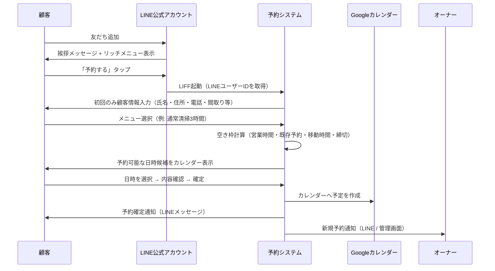
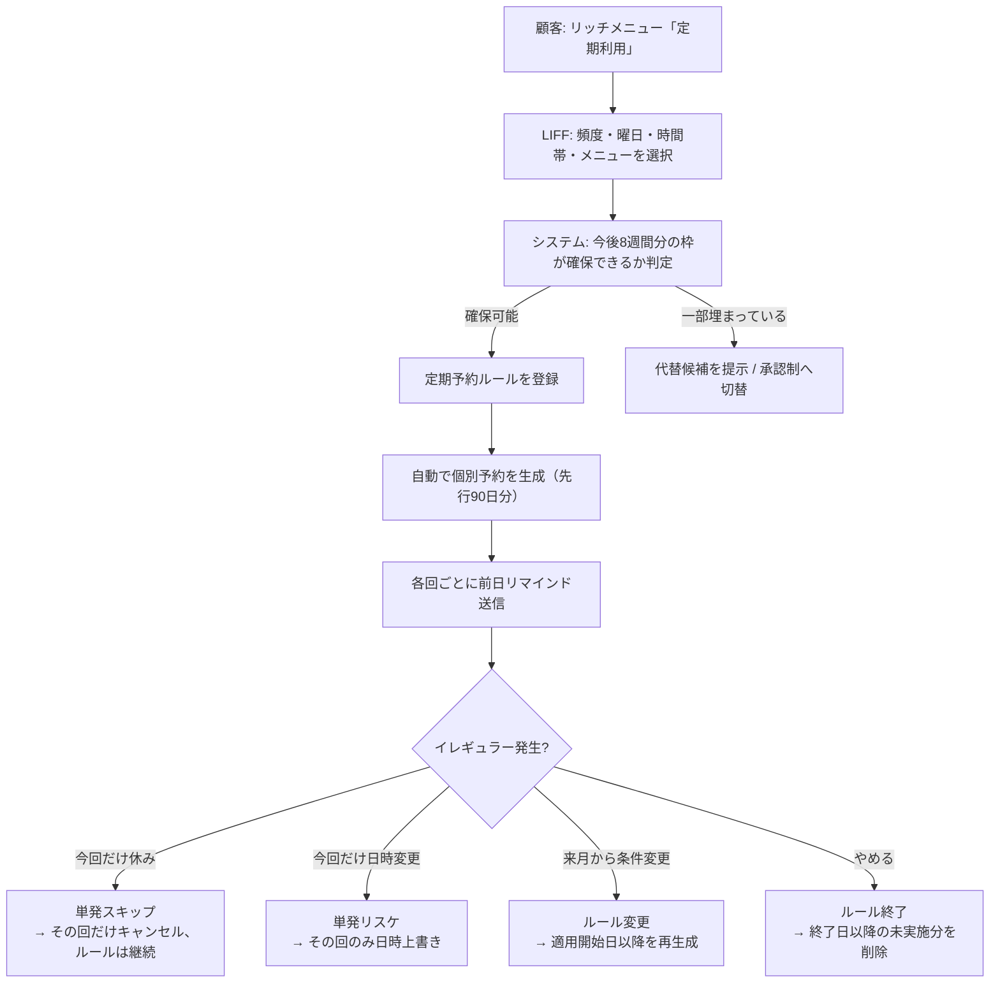
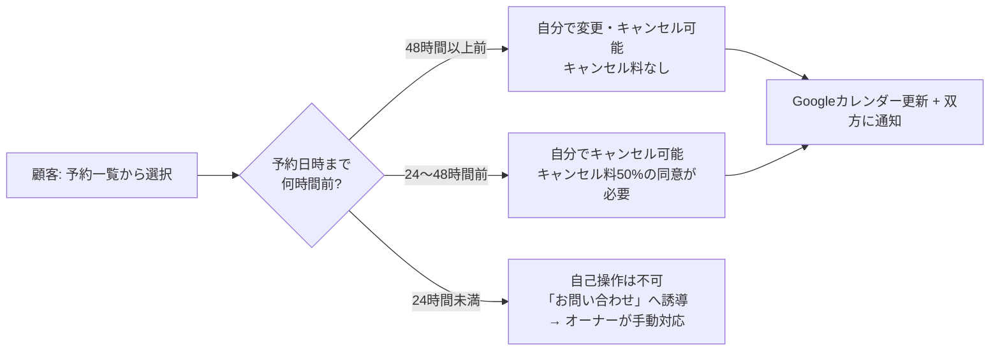
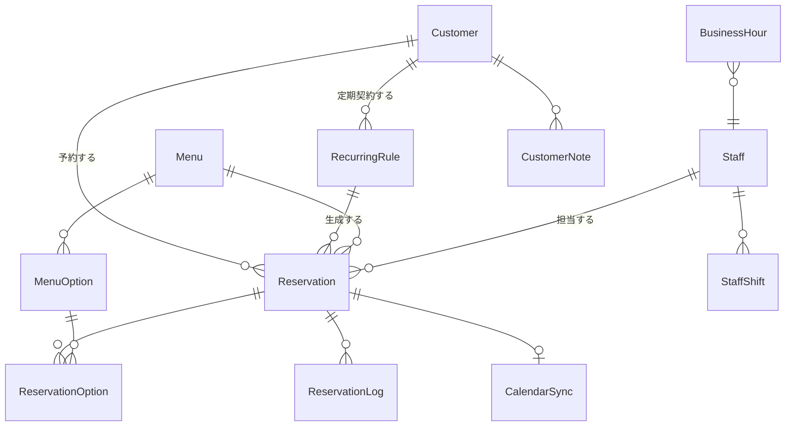
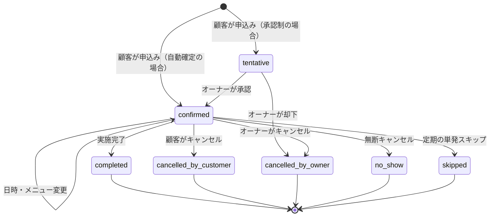

# LINE予約システム 要件定義書

**対象事業**: お掃除の家事代行 / 片付けコンサルティング
**システム名（仮）**: LINE予約システム
**版数**: v1.0（初版）
**作成日**: 2026-08-14

---

## 1. プロジェクト概要

### 1.1 背景と課題

現状、家事代行・片付けコンサルの予約受付はLINEのトークでの個別やり取りが中心と想定される。この運用には以下の課題がある。

| # | 課題 | 影響 |
|---|---|---|
| 1 | 予約の受付・調整が手作業のチャット往復 | 1件あたり数往復、対応漏れ・二重予約のリスク |
| 2 | 空き状況を自分で確認して返信する必要がある | 営業時間外の問い合わせに即応できず機会損失 |
| 3 | 定期利用（毎週・隔週など）の管理が台帳・手帳ベース | 「今週だけ休み」「来月から時間変更」等のイレギュラー対応が煩雑 |
| 4 | 変更・キャンセルの連絡が口頭/チャットで記録が残りにくい | 直前キャンセルの把握、キャンセルポリシー運用が曖昧 |
| 5 | 移動時間を考慮した枠取りが属人的 | 詰め込みすぎ／空きすぎによる稼働率低下 |

### 1.2 目的

1. **お客様がLINEだけで24時間、予約・変更・キャンセル・定期利用の申込みを完結できる**
2. **オーナーが管理画面とGoogleカレンダーの両方でスケジュールを一元把握できる**
3. **定期利用の「イレギュラー対応」を数クリックで処理できる**
4. **予約受付にかかる手作業をなくし、施術・コンサル本業に時間を割けるようにする**

### 1.3 成功指標（KPI）

| 指標 | 現状（想定） | 目標（稼働3ヶ月後） |
|---|---|---|
| 予約1件あたりの調整往復数 | 3〜5往復 | 0往復（自動完結率80%以上） |
| 予約受付にかける事務作業時間 | 週5時間程度 | 週1時間以下 |
| 二重予約・ダブルブッキング発生件数 | 月1件程度 | 0件 |
| 無断キャンセル（No Show）率 | 5%程度 | 2%以下（前日リマインド効果） |
| 定期利用顧客の継続率 | — | 計測可能にする（ダッシュボードで可視化） |

---

## 2. スコープ

### 2.1 対象範囲（v1で作るもの）

- LINE公式アカウント上での顧客向け予約機能（LIFFアプリ + リッチメニュー + 自動通知）
- 管理者向けWeb管理画面（スケジュール管理・顧客管理・メニュー管理・設定）
- Googleカレンダーとの双方向同期
- 単発予約 / 定期予約の両方の管理と、定期予約のイレギュラー対応

### 2.2 対象外（v1では作らないもの）

| 項目 | 理由 / 将来の扱い |
|---|---|
| オンラインカード決済 | 現状は現金・銀行振込のみ。**Phase 3で追加できる拡張点だけ設計に残す** |
| 請求書・領収書の自動発行 | v1は金額の記録とCSV出力まで。会計ソフト連携は将来検討 |
| 複数店舗・複数拠点管理 | 単一事業者を前提とする |
| スタッフの給与・シフト給計算 | 勤怠のみ将来対応。給与計算は対象外 |
| 顧客のスマホアプリ（ネイティブ） | LINEで完結させるため不要 |
| SMS / メールでの予約受付 | LINE単一チャネルとする（メールは管理者向け通知のみ） |

### 2.3 前提条件

| 項目 | 前提 |
|---|---|
| スタッフ体制 | 当面はオーナー1名。**半年以内に複数スタッフへ拡張予定のため、データ構造は最初から複数スタッフ対応で設計する**（UIはv1では1人運用に最適化し、スタッフ管理画面はPhase 2で解放） |
| 決済 | 現金・銀行振込。システムは「金額の提示」と「入金済フラグの記録」までを担う |
| LINE公式アカウント | 既存アカウントを利用、または新規開設。**Messaging APIを利用するためLINE Developersでのチャネル作成が必要** |
| 料金プラン | 通知メッセージ数に応じてLINE公式アカウントの料金プラン選定が必要（後述 12.3） |
| Googleアカウント | オーナーのGoogleカレンダーを同期先とする |
| 対応言語 | 日本語のみ |
| 対応端末 | 顧客: スマートフォン（LINEアプリ内ブラウザ）／管理: PC・タブレット・スマートフォン |

---

## 3. 登場人物（ロール）

| ロール | 説明 | 主な利用手段 |
|---|---|---|
| **顧客（一般ユーザー）** | LINE公式アカウントの友だち。予約する人 | LINEアプリ（リッチメニュー・LIFF・トーク通知） |
| **オーナー（管理者）** | 事業主。全機能にアクセス可能 | Web管理画面 / Googleカレンダー |
| **スタッフ**（Phase 2〜） | 施術担当者。自分の予定の閲覧と一部操作のみ | Web管理画面（権限制限） |
| **システム** | 通知の自動送信、定期予約の自動生成、同期処理 | バッチ / Webhook |

---

## 4. 業務フロー（To-Be）

### 4.1 新規顧客の初回予約



### 4.2 定期利用の申込みと運用



### 4.3 変更・キャンセル



> ⚠️ 上記の時間しきい値とキャンセル料率は**設定画面から変更可能**とする（初期値は仮置き。実運用のポリシーに合わせて要調整）。

---

## 5. 機能要件

### 5.1 顧客側（LINE / LIFF）

#### 5.1.1 リッチメニュー

タブ切替式（2面）を想定。**未予約者と予約保有者でメニューを出し分ける**（LINEのリッチメニューリンク機能を利用）。

**Aパターン: 初回・予約なしの人**

| ボタン | 遷移先 |
|---|---|
| はじめての方へ | サービス紹介ページ（LIFF or 外部LP） |
| 料金・メニューを見る | メニュー一覧（LIFF） |
| **予約する** | 予約フロー（LIFF） |
| 定期利用について | 定期プラン説明 → 申込み（LIFF） |
| よくある質問 | FAQ（LIFF） |
| お問い合わせ | トーク（有人対応へ切替） |

**Bパターン: 予約がある人**

| ボタン | 遷移先 |
|---|---|
| **次回の予約を確認** | 予約詳細（LIFF） |
| 予約を変更する | 変更フロー（LIFF） |
| キャンセルする | キャンセルフロー（LIFF） |
| 定期利用の管理 | 定期ルール一覧・スキップ・変更（LIFF） |
| 新しく予約する | 予約フロー（LIFF） |
| お問い合わせ | トーク |

- 管理画面からリッチメニュー画像の差し替え・ボタン領域の設定・公開/非公開の切替ができること
- リッチメニューはLINE Messaging APIで登録・切替を行い、**管理画面から再アップロードできる**こと

#### 5.1.2 顧客登録（初回のみ）

LIFFから初回アクセス時に取得する情報:

| 項目 | 必須 | 備考 |
|---|---|---|
| LINEユーザーID | ○ | LIFFから自動取得（顧客の入力不要） |
| 氏名（漢字・かな） | ○ | |
| 電話番号 | ○ | 当日連絡用 |
| 住所（郵便番号・都道府県・市区町村・番地・建物名） | ○ | 郵便番号から自動補完。**訪問可能エリア判定に使用** |
| 間取り / 広さ | ○ | 所要時間の目安算出に使用（例: 1LDK / 3LDK） |
| 駐車場の有無 | △ | 移動計画に使用 |
| ペットの有無・アレルギー等の注意事項 | △ | |
| 鍵の受け渡し方法 | △ | 在宅 / キーボックス / 預かり |
| 要望・伝達事項（自由記述） | △ | |
| 個人情報の取扱いへの同意 | ○ | チェックボックス、同意日時を記録 |

- 2回目以降は入力済み情報を再利用し、変更があれば「登録情報の変更」から更新できること

#### 5.1.3 メニュー選択・予約

- カテゴリ別にメニューを表示（例: 「お掃除」「片付けコンサル」「スポット」「初回お試し」）
- 各メニューの表示項目: 名称 / 説明 / 所要時間 / 料金 / 画像 / オプション
- **オプション追加**（例: 換気扇クリーニング +60分 +5,000円、水回り追加など）— 選択に応じて所要時間と料金が加算される
- 所要時間はメニューの基本時間 + オプション時間 + （間取りに応じた補正）で算出
- 日付を選ぶとその日の空き時間帯が表示され、埋まっている時間は選択不可
- 予約確定前に「日時 / メニュー / オプション / 所要時間 / 合計金額 / 訪問先住所 / キャンセルポリシー」を確認画面で提示
- 確定後、LINEに予約確定メッセージ（Flex Message）を送信

#### 5.1.4 空き枠の表示ルール（重要）

空き枠は以下をすべて満たす時間帯のみ提示する。

| 条件 | 説明 |
|---|---|
| 営業時間内 | 曜日ごとの営業時間設定に収まること（例: 平日9:00-18:00、土9:00-15:00、日祝休） |
| 休業日でない | 個別休業日・臨時休業日を除外 |
| 既存予約と重複しない | 確定・仮予約の両方を考慮 |
| **移動時間バッファを確保** | 前後の予約との間に移動時間を確保。v1は「一律◯分」を設定値とする（例: 60分）。将来的には住所間の距離からの自動算出を検討 |
| 準備・片付けバッファ | 各予約の前後に固定バッファ（例: 前15分 / 後15分） |
| 受付締切を過ぎていない | 例: 前日18時まで／24時間前まで（設定可能） |
| 予約可能期間内 | 例: 本日から90日先まで（設定可能） |
| 1日の最大受注件数を超えない | 例: 1日3件まで（設定可能） |
| Googleカレンダーの私用予定と重複しない | 「予定あり」として登録された私用予定を自動でブロック |

- 表示粒度は30分単位（設定可能）
- 「午前 / 午後 / 夕方」の時間帯ざっくり選択にも対応（詳細時刻はシステムが割り当て）

#### 5.1.5 予約の確認・変更・キャンセル

- 予約一覧（今後の予定 / 過去の履歴）を表示
- 予約詳細から「変更」「キャンセル」を実行
- 変更は「日時のみ変更」「メニュー変更」の両方に対応
- キャンセルポリシーに応じてキャンセル料の表示と同意取得（4.3参照）
- 締切を過ぎた操作は自己完結させず、オーナーへの問い合わせに誘導
- 変更・キャンセルの結果はLINE通知 + Googleカレンダー反映 + 管理画面の履歴に記録

#### 5.1.6 定期利用

**登録**

| 設定項目 | 選択肢 |
|---|---|
| 頻度 | 毎週 / 隔週 / 4週ごと / 毎月第N曜日 / 月1回（日付指定） |
| 曜日・時刻 | 例: 毎週火曜 10:00〜 |
| メニュー | 定期用メニュー（単発より割安な料金設定が可能） |
| 開始日 | 直近の該当曜日から選択 |
| 終了条件 | 無期限 / 回数指定（例: 全12回） / 終了日指定 |

- 登録時に**直近8回分の枠が確保できるか事前チェック**し、確保できない回がある場合は代替時刻を提案するか、オーナー承認待ちにする
- 登録後、先行90日分の個別予約を自動生成（以降は日次バッチで生成を継続）

**変更・キャンセル**

| 操作 | 挙動 |
|---|---|
| **今回だけ休む（スキップ）** | 該当回のみキャンセル。ルールと以降の予定は維持 |
| **今回だけ日時を変える（単発リスケ）** | 該当回のみ日時を上書き。以降は元の曜日・時刻のまま |
| **来週から条件を変える** | 適用開始日を指定してルールを変更。**過去分と実施済み分は変更しない**。適用開始日以降の未実施分を再生成 |
| **定期をやめる** | 終了日を設定。それ以降の未実施分を削除。それまでの予定は維持 |
| **一時休止** | 期間を指定して休止（例: 8/10〜8/20）。その期間の回のみ削除、再開後は自動継続 |

- 各操作について、キャンセルポリシーの適用有無を設定できること（例: 定期のスキップは3日前まで無料）

#### 5.1.7 通知（顧客向け）

| タイミング | 内容 | 形式 |
|---|---|---|
| 友だち追加時 | 挨拶 + サービス案内 + 予約導線 | Flex Message |
| 予約確定時 | 日時・メニュー・料金・住所・キャンセルポリシー | Flex Message |
| 予約変更時 | 変更前後の内容 | Flex Message |
| キャンセル完了時 | キャンセル内容・キャンセル料の有無 | テキスト |
| **前日リマインド** | 明日の予約内容 + 「変更・キャンセルはこちら」 | Flex Message（送信時刻は設定可能、既定18:00） |
| 当日朝リマインド（任意） | 本日の訪問予定時刻 | テキスト（ON/OFF設定可） |
| 施術完了後 | お礼 + 次回予約導線 + （任意）レビュー依頼 | Flex Message |
| 定期予約の翌月分確定時 | 翌月の予定一覧 | Flex Message（月次） |
| オーナー都合の日時変更時 | 変更依頼と代替候補の提示 | Flex Message |

- 通知文面は**管理画面のテンプレートから編集可能**とする（変数埋め込み: `{顧客名}` `{日時}` `{メニュー}` `{金額}` 等）
- 通知の送信結果（成功/失敗、ブロック済みユーザー）をログに残す

---

### 5.2 管理側（Web管理画面）

#### 5.2.1 ダッシュボード

- 本日の訪問予定一覧（時刻順、住所・顧客名・メニュー・移動時間つき）
- 未確認の新規予約 / 変更 / キャンセルの通知
- 承認待ちの申込み（あれば）
- 今週・今月の予約件数、売上見込み、稼働率
- 定期顧客数と継続状況

#### 5.2.2 スケジュール管理（カレンダー）

- **表示**: 日 / 週 / 月 / リスト の4ビュー
- 予約はメニュー種別ごとに色分け（単発 / 定期 / 仮予約 / ブロック）
- **ドラッグ&ドロップで日時変更**（変更時は空き枠バリデーション + 顧客への通知確認ダイアログ）
- 予約枠のクリックで詳細を開き、編集・キャンセル・メモ追記
- **手動での予約作成**（電話・紹介など、LINE外から入った予約の登録）
- **ブロック枠の作成**（私用・移動・研修などで予約を受け付けない時間の設定）
- 定期予約は連なりが視覚的に分かるよう表示（同一ルールにバッジ表示）

#### 5.2.3 定期予約の管理・イレギュラー対応

- 定期ルール一覧（顧客名 / 頻度 / 曜日時刻 / メニュー / 次回 / 残回数 / 状態）
- ルール詳細から、**個別回の一覧**を表示し以下を回ごとに操作:
  - この回だけ日時変更（リスケ）
  - この回だけスキップ（キャンセル）
  - この回だけメニュー・所要時間の変更（例: 大掃除で今回だけ5時間）
  - この回だけ担当スタッフ変更（Phase 2）
  - メモの追加
- ルール自体の操作: 一時休止 / 再開 / 条件変更（適用開始日つき）/ 終了
- **祝日・年末年始の一括処理**: 指定期間の定期予約をまとめてスキップ or 前後にずらす提案
- イレギュラー操作の履歴を全件保持（誰が・いつ・何を変更したか）

#### 5.2.4 顧客管理

- 顧客一覧（氏名 / 電話 / 住所 / 最終利用日 / 累計利用回数 / 累計金額 / 定期の有無 / タグ）
- 顧客詳細:
  - 基本情報（5.1.2の項目）
  - 予約履歴（実施済み / 今後 / キャンセル履歴）
  - **カルテ・申し送り**（作業内容の記録、写真添付、次回への引き継ぎメモ）
  - 支払い状況（現金受領済 / 振込確認済 / 未収）
  - 顧客ごとのメモ（社内用、顧客には非表示）
  - タグ付け（例: VIP / ペットあり / 鍵預かり / 要注意）
- LINEトークへの個別メッセージ送信（管理画面から）
- 顧客情報のCSVエクスポート

#### 5.2.5 メニュー管理

- メニューのCRUD（名称 / カテゴリ / 説明 / 画像 / 基本所要時間 / 料金 / 表示順 / 公開・非公開）
- オプションのCRUD（名称 / 追加時間 / 追加料金 / 対象メニュー）
- **定期専用メニュー**の設定（定期割引料金）
- 間取り別の所要時間補正表（例: 〜1LDK: 基本、2LDK: +30分、3LDK以上: +60分）
- メニュー単位の予約可否設定（例: 「初回お試し」は初回利用者のみ選択可能）

#### 5.2.6 スケジュール設定

- 曜日別の営業時間
- 定休日 / 臨時休業日（期間指定可）
- 移動時間バッファ（既定値、および顧客・エリアごとの上書き）
- 前後の準備・片付けバッファ
- 予約受付締切（例: 24時間前）
- 予約可能期間（例: 90日先まで）
- 1日の最大受注件数、1週間の最大稼働時間
- 予約枠の粒度（15/30/60分）
- **対応可能エリア**（郵便番号・市区町村単位のホワイトリスト。範囲外は予約不可 + 問い合わせ誘導）
- キャンセルポリシー（時間しきい値ごとのキャンセル料率）

#### 5.2.7 通知・LINE設定

- 通知テンプレートの編集（5.1.7の各種通知）
- リマインド送信時刻の設定
- リッチメニューの画像アップロード・タップ領域設定・切替ルール
- 一斉配信（セグメント指定: 全員 / 定期顧客 / 3ヶ月未利用者 など）
- 自動応答（営業時間外メッセージ、キーワード応答）

#### 5.2.8 売上・レポート

- 期間指定の売上集計（メニュー別 / 単発・定期別 / 顧客別）
- 予約件数、キャンセル率、稼働率
- 新規 / リピート比率
- CSVエクスポート（会計処理用）

#### 5.2.9 スタッフ管理（Phase 2）

- スタッフのCRUD、勤務可能時間（シフト）の設定
- スタッフ別の対応可能メニュー・対応可能エリア
- 予約への担当割当（自動割当 / 手動割当）
- 権限管理（オーナー: 全権 / スタッフ: 自分の予定の閲覧と限定操作）

---

### 5.3 外部連携

#### 5.3.1 LINE Messaging API / LIFF

| 用途 | 仕様 |
|---|---|
| Webhook受信 | 友だち追加、ブロック、メッセージ受信、ポストバック（ボタン押下）を受信 |
| 署名検証 | `X-Line-Signature` を必ず検証し、不正リクエストを拒否 |
| メッセージ送信 | プッシュメッセージ（通知）、リプライメッセージ（応答） |
| Flex Message | 予約確定・リマインド等をカード形式で表示 |
| LIFF | 予約画面をLINE内ブラウザで表示。`liff.getIDToken()` でユーザー本人性を検証 |
| リッチメニュー | API経由で登録・切替（ユーザー単位のリンク切替に対応） |
| 冪等性 | Webhookの再送に備え、イベントIDで重複処理を防止 |

#### 5.3.2 Googleカレンダー同期

**同期方針: 予約データの「正」は本システムのDB。Googleカレンダーはミラー + 私用予定の取り込み口。**

| 方向 | 内容 |
|---|---|
| **システム → Google（書き出し）** | 予約の作成・変更・キャンセルをGoogleカレンダーのイベントに反映。イベントには顧客名・メニュー・住所・電話・所要時間を記載し、システムの予約詳細画面へのリンクを含める |
| **Google → システム（取り込み）** | オーナーがGoogleカレンダーに登録した私用予定を「ブロック枠」として取り込み、空き枠から除外する |
| 実装方式 | Google Calendar API + **Push通知（Watch API）** による差分同期。Watchの有効期限切れに備え、日次のフル差分同期をフォールバックとして実行 |
| 対象カレンダー | 業務用カレンダー（書き出し先）と、取り込み対象カレンダー（複数指定可）を設定画面で選択 |
| 競合時のルール | Googleカレンダー側で**システムが作成したイベント**が編集・削除された場合は、システム側を正としてGoogle側を復元し、管理画面に警告を表示（v1）。※Google側の編集をシステムに反映する双方向マージはv1では行わない |
| 識別 | システム作成イベントには `extendedProperties.private.reservationId` を付与して識別 |
| 認証 | OAuth 2.0（オーナーのGoogleアカウントで初回認可、リフレッシュトークンを暗号化保存） |
| 障害時 | Google API障害時も予約受付は継続。同期は失敗キューに退避し自動リトライ（指数バックオフ、最大5回）。失敗継続時は管理画面に通知 |

#### 5.3.3 将来の連携（拡張点として設計に残す）

| 連携先 | 用途 | 時期 |
|---|---|---|
| Stripe | オンライン決済、定期課金、キャンセル料の自動徴収 | Phase 3 |
| 会計ソフト（freee / マネーフォワード） | 売上データ連携 | 検討 |
| Googleマップ / 距離行列API | 住所間の実移動時間を自動算出しバッファに反映 | Phase 3 |

---

## 6. 非機能要件

| 分類 | 要件 |
|---|---|
| **性能** | LIFFの初期表示3秒以内、空き枠検索のレスポンス1秒以内。同時接続50程度を想定 |
| **可用性** | 稼働率99%以上を目標。計画メンテナンスは深夜帯に実施 |
| **拡張性** | 顧客数1,000件、年間予約数3,000件規模まで問題なく動作すること |
| **セキュリティ** | 全通信HTTPS。LINE Webhookの署名検証必須。LIFF IDトークンの検証必須。管理画面はメール+パスワード認証 + 2要素認証（TOTP）。総当たり対策のレート制限 |
| **個人情報保護** | 住所・電話・鍵の受け渡し方法などの機微情報を扱う。DBの保存時暗号化、アクセスログの記録、退会時のデータ削除フローを用意。プライバシーポリシーの掲示と初回同意取得を必須とする |
| **監査ログ** | 予約の作成・変更・キャンセル・定期ルールの操作を、実行者・日時・変更前後の値つきで永続保存 |
| **バックアップ** | DBの日次自動バックアップ、7日以上の世代保持、リストア手順の文書化 |
| **障害通知** | 同期失敗・通知送信失敗・エラー率上昇をオーナーへ通知（メール or LINE） |
| **タイムゾーン** | 全てAsia/Tokyoで扱う。DBはUTC保存、表示時にJST変換 |
| **ブラウザ対応** | LINE内ブラウザ（iOS/Android）、Chrome / Safari / Edge の最新2バージョン |
| **アクセシビリティ** | 文字サイズ・コントラストに配慮。50代以上の顧客も想定し、ボタンは大きく、1画面1アクションを基本とする |

---

## 7. データモデル（主要エンティティ）



### 7.1 主要テーブル定義

**Customer（顧客）**
`id` / `lineUserId`(unique) / `displayName` / `name` / `nameKana` / `phone` / `postalCode` / `address` / `buildingName` / `layout`(間取り) / `hasParking` / `hasPet` / `keyHandover` / `notes` / `tags[]` / `privacyConsentAt` / `status`(active/blocked/withdrawn) / `createdAt` / `updatedAt`

**Menu（メニュー）**
`id` / `category` / `name` / `description` / `imageUrl` / `durationMinutes` / `price` / `isRecurringOnly` / `isFirstTimeOnly` / `sortOrder` / `isPublished`

**MenuOption（オプション）**
`id` / `menuId`(null可=全メニュー共通) / `name` / `additionalMinutes` / `additionalPrice` / `sortOrder` / `isPublished`

**Reservation（予約 / 定期の各回もここに実体化される）**
`id` / `customerId` / `staffId` / `menuId` / `recurringRuleId`(null可) / `occurrenceDate`(定期の本来の実施日) / `startAt` / `endAt` / `totalMinutes` / `totalPrice` / `status` / `source`(line/admin/phone) / `isException`(定期からの逸脱フラグ) / `paymentStatus`(unpaid/cash_received/transfer_confirmed) / `customerNote` / `internalNote` / `cancelledAt` / `cancelReason` / `cancelFee` / `createdAt` / `updatedAt`

`status`: `tentative`(仮) / `confirmed`(確定) / `completed`(実施済) / `cancelled_by_customer` / `cancelled_by_owner` / `no_show` / `skipped`(定期のスキップ)

**RecurringRule（定期ルール）**
`id` / `customerId` / `staffId` / `menuId` / `frequency`(weekly/biweekly/every4weeks/monthly_nth/monthly_date) / `dayOfWeek` / `nthWeek` / `dayOfMonth` / `startTime` / `durationMinutes` / `startDate` / `endDate`(null=無期限) / `totalOccurrences`(null=無期限) / `status`(active/paused/ended) / `pausedFrom` / `pausedTo` / `generatedUntil`(どこまで実体化済みか) / `createdAt`

> **設計上の要点**: 定期予約は「ルール」と「各回の実体（Reservation）」を分離する。各回を実体化しておくことで、1回だけの日時変更・スキップ・メニュー変更といったイレギュラー対応が、ルールを壊さずに扱える。ルール変更時は `generatedUntil` 以降の**未実施かつ `isException=false` の回のみ**再生成し、個別に手を入れた回（`isException=true`）は保護する。

**BusinessHour（営業時間）**
`id` / `staffId`(null=全体設定) / `dayOfWeek` / `openTime` / `closeTime` / `isClosed`

**Holiday（休業日）**
`id` / `staffId`(null=全体) / `date` / `endDate` / `reason`

**BlockedSlot（ブロック枠）**
`id` / `staffId` / `startAt` / `endAt` / `title` / `source`(manual/google) / `googleEventId`

**Staff（スタッフ）** ※Phase 2で本格利用。v1もオーナー1件を登録して運用
`id` / `name` / `email` / `role`(owner/staff) / `availableMenuIds[]` / `availableAreas[]` / `isActive`

**Setting（各種設定）**
`key` / `value`(JSON) — 移動時間バッファ、締切、予約可能期間、キャンセルポリシー、リマインド時刻、対応エリア等

**NotificationLog（通知ログ）**
`id` / `customerId` / `reservationId` / `type` / `sentAt` / `status` / `errorMessage`

**ReservationLog（監査ログ）**
`id` / `reservationId` / `actorType`(customer/owner/staff/system) / `actorId` / `action` / `beforeJson` / `afterJson` / `createdAt`

**CalendarSync（カレンダー同期状態）**
`id` / `reservationId` / `googleEventId` / `googleCalendarId` / `lastSyncedAt` / `syncStatus` / `retryCount`

---

## 8. 画面一覧

### 8.1 顧客側（LIFF）

| # | 画面 | 概要 |
|---|---|---|
| C-01 | サービス紹介 | 事業内容・実績・料金の概要 |
| C-02 | 初回顧客登録 | 氏名・住所等の入力、個人情報同意 |
| C-03 | メニュー一覧 | カテゴリ別のメニューカード |
| C-04 | メニュー詳細・オプション選択 | 所要時間・料金の自動計算 |
| C-05 | 日時選択（カレンダー） | 月表示 → 日別の空き時間帯 |
| C-06 | 予約内容確認 | 最終確認 + キャンセルポリシー同意 |
| C-07 | 予約完了 | 完了メッセージ + カレンダー追加導線 |
| C-08 | 予約一覧（今後 / 履歴） | ステータス別 |
| C-09 | 予約詳細 | 変更・キャンセル導線 |
| C-10 | 予約変更 | 日時・メニューの変更 |
| C-11 | キャンセル確認 | キャンセル料の提示と同意 |
| C-12 | 定期利用の申込み | 頻度・曜日・時刻・開始日の設定 |
| C-13 | 定期ルール一覧・詳細 | 次回以降の予定表示 |
| C-14 | 定期のスキップ / リスケ / 変更 / 解約 | 各回操作とルール操作 |
| C-15 | 登録情報の変更 | 住所・電話等の更新 |
| C-16 | FAQ | よくある質問 |

### 8.2 管理側（Web）

| # | 画面 | 概要 |
|---|---|---|
| A-01 | ログイン（2要素認証） | |
| A-02 | ダッシュボード | 本日の予定・未読通知・KPI |
| A-03 | カレンダー（日/週/月/リスト） | D&Dでのリスケ、ブロック枠作成 |
| A-04 | 予約詳細・編集 | ステータス変更、メモ、支払い記録 |
| A-05 | 予約の新規手動登録 | 電話予約等の登録 |
| A-06 | 定期ルール一覧 | 状態別フィルタ |
| A-07 | 定期ルール詳細（各回一覧） | 回ごとのイレギュラー操作 |
| A-08 | 顧客一覧 | 検索・タグ絞り込み |
| A-09 | 顧客詳細（カルテ含む） | 履歴・メモ・写真 |
| A-10 | メニュー・オプション管理 | |
| A-11 | スケジュール設定 | 営業時間・休業日・バッファ・締切・エリア |
| A-12 | キャンセルポリシー設定 | |
| A-13 | 通知テンプレート管理 | |
| A-14 | リッチメニュー管理 | 画像アップロード・領域設定・切替 |
| A-15 | 一斉配信 | セグメント配信 |
| A-16 | 売上・レポート | 集計・CSV出力 |
| A-17 | Googleカレンダー連携設定 | 認可・対象カレンダー選択・同期状況 |
| A-18 | スタッフ管理（Phase 2） | シフト・権限 |
| A-19 | 操作ログ | 監査証跡 |

---

## 9. 技術構成（提案）

| 層 | 技術 | 選定理由 |
|---|---|---|
| フロントエンド（LIFF / 管理画面） | **Next.js (App Router) + TypeScript + Tailwind CSS** | LIFFと管理画面を1つのコードベースで管理でき、SSRで初期表示が速い |
| UIコンポーネント | shadcn/ui | 管理画面のフォーム・テーブルを短期間で構築 |
| カレンダーUI | FullCalendar | D&Dリスケ、週/月表示に標準対応 |
| バックエンド | Next.js Route Handlers（API） | 構成をシンプルに保つ |
| データベース | **PostgreSQL**（Supabase または Neon） | リレーション・トランザクションが必要。時刻範囲の重複判定に強い |
| ORM | Prisma | 型安全なスキーマ管理とマイグレーション |
| 認証（管理画面） | Auth.js（NextAuth）+ TOTP 2要素認証 | |
| ホスティング | **Vercel** | Next.jsとの親和性、デプロイの容易さ |
| バッチ処理 | Vercel Cron（日次: 定期予約の生成 / リマインド送信 / カレンダー差分同期） | |
| 外部API | LINE Messaging API SDK、LIFF v2、Google Calendar API v3 | |
| 画像保存 | Vercel Blob または Supabase Storage | メニュー画像・カルテ写真 |
| エラー監視 | Sentry | |

> ※上記は推奨構成です。既にお使いのサーバーや希望技術があれば合わせて調整します。

---

## 10. 開発フェーズと想定スケジュール

| フェーズ | 内容 | 想定期間 |
|---|---|---|
| **Phase 0: 準備** | LINE公式アカウント/Messaging APIチャネル開設、Google Cloudプロジェクト作成、ドメイン・環境準備、メニューと料金の確定、キャンセルポリシー確定 | 1週間 |
| **Phase 1: MVP** | 顧客登録 / メニュー選択 / 単発予約・変更・キャンセル / リッチメニュー / 予約確定・リマインド通知 / 管理画面のカレンダーと予約管理 / Googleカレンダー同期 | 4〜5週間 |
| **Phase 2: 定期予約 + 運用強化** | 定期利用の登録・変更・スキップ・解約 / イレギュラー対応 / 顧客カルテ / 売上レポート / 一斉配信 / スタッフ管理の解放 | 3〜4週間 |
| **Phase 3: 拡張** | オンライン決済（Stripe）/ 距離ベースの移動時間自動算出 / レビュー依頼 / 会計連携 | 別途 |

**運用開始の目安**: Phase 1完了時点でLINEからの単発予約受付を開始し、定期利用は当面手動運用と並行 → Phase 2完了後に完全移行、という段階導入を推奨します。

---

## 11. リスクと対策

| # | リスク | 影響 | 対策 |
|---|---|---|---|
| 1 | Googleカレンダー側で予定を直接編集し、システムと不整合 | ダブルブッキング | システム側を正とし、Google側の編集を検知して復元 + 警告表示。運用ルールとして「予約の変更は管理画面から」を徹底 |
| 2 | 移動時間を一律固定にすると、遠方案件で移動が間に合わない | 遅刻・信用低下 | エリア別にバッファを設定できるようにする。Phase 3で距離ベース自動算出 |
| 3 | LINEの通知数がプラン上限を超過 | 追加課金 | リマインド等の送信数を試算し適切なプランを選択（12.3）。管理画面に月間送信数の表示 |
| 4 | 定期予約のルール変更で過去分まで書き換わる | 実績データの破壊 | 実施済み・個別変更済みの回は再生成対象から除外する設計とする |
| 5 | 顧客がLINEをブロック → 通知が届かない | 無断キャンセル | ブロック検知時に管理画面で警告表示、電話での連絡を促す |
| 6 | 住所・鍵情報の漏洩 | 重大 | 保存時暗号化、アクセスログ、権限分離、2要素認証 |
| 7 | 直前キャンセルの多発 | 売上減 | キャンセルポリシーの明示と同意取得、Phase 3で事前決済導入 |
| 8 | 対応エリア外からの予約 | 対応不可 | 郵便番号によるエリア判定で予約前にブロック |

---

## 12. 確認事項・今後決めること

### 12.1 事業ルールの確定が必要な項目

| # | 項目 | なぜ必要か |
|---|---|---|
| 1 | **メニューと料金の一覧**（名称・所要時間・価格・オプション） | 予約画面の中身そのもの |
| 2 | **営業時間・定休日** | 空き枠計算の前提 |
| 3 | **対応可能エリア**（市区町村 or 郵便番号） | エリア外予約のブロック判定 |
| 4 | **移動時間バッファの目安**（例: 60分） | 枠の詰め方が変わる |
| 5 | **1日の最大受注件数** | 稼働の上限 |
| 6 | **予約受付締切**（例: 前日18時 / 24時間前） | 直前予約の可否 |
| 7 | **キャンセルポリシー**（何時間前まで無料か、キャンセル料率） | 顧客への提示文と自動判定 |
| 8 | **定期利用の割引の有無と料率** | 定期メニューの料金設定 |
| 9 | **定期のスキップは何日前まで無料か** | イレギュラー対応のルール |
| 10 | 片付けコンサルは訪問かオンラインか（両方か） | オンラインの場合、住所ではなくURL発行が必要 |
| 11 | 初回のヒアリング・見積りが必要な業務があるか | 「見積り相談」フローの要否 |

### 12.2 アカウント・環境の準備

- LINE公式アカウント（既存があればアカウントID。なければ新規開設）
- LINE Developersアカウント（Messaging APIチャネル + LIFFアプリの作成）
- Googleアカウント（同期先のカレンダー）
- 独自ドメイン（LIFFのエンドポイントURL用。なくても開始は可能）
- プライバシーポリシー・利用規約の文面

### 12.3 想定ランニングコスト（月額・概算）

| 項目 | 概算 | 備考 |
|---|---|---|
| LINE公式アカウント | 0円 〜 5,500円 | コミュニケーションプラン（月200通まで無料）／ライトプラン5,000通/月 5,500円。**顧客50名・月4通の通知で200通、100名なら400通** → 顧客数に応じてライトプラン以上が必要 |
| ホスティング（Vercel） | 0円 〜 3,000円程度 | 個人利用規模ならHobbyでも可、業務利用はProを推奨 |
| データベース | 0円 〜 4,000円程度 | Supabase / Neonの無料枠で開始可能 |
| Google Calendar API | 0円 | 無料枠内 |
| ドメイン | 年1,500円程度 | |
| **合計** | **月0円〜13,000円程度** | 稼働初期は無料枠中心で開始可能 |

---

## 13. 用語定義

| 用語 | 定義 |
|---|---|
| **LIFF** | LINE Front-end Framework。LINEアプリ内で動くWebアプリ。ユーザーIDを取得でき、ログイン不要で本人特定ができる |
| **リッチメニュー** | LINEトーク画面下部に固定表示されるメニュー画像。タップ領域ごとに動作を設定できる |
| **Flex Message** | 画像・ボタン・レイアウトを自由に組めるLINEのカード型メッセージ |
| **定期ルール** | 「毎週火曜10時」のような繰り返しの定義そのもの |
| **各回（オカレンス）** | 定期ルールから生成された、実際の1回分の予約 |
| **イレギュラー対応** | 定期ルールはそのままに、特定の回だけ日時・内容を変えたりスキップしたりすること |
| **ブロック枠** | 予約を受け付けない時間帯（私用・移動・研修など） |
| **仮予約** | 顧客が申込みしたがオーナー承認待ちの状態 |

---

## 付録A: 予約ステータスの遷移



## 付録B: 定期ルール変更時の再生成ロジック（擬似コード）

```
ルール変更(ruleId, 新条件, 適用開始日):
    # 1. 保護対象を確定する
    保護対象 = 該当ルールの予約のうち、以下のいずれか
        - 実施済み (status = completed)
        - 適用開始日より前
        - 個別に変更済み (isException = true)

    # 2. 再生成対象を削除
    削除対象 = 該当ルールの予約 - 保護対象 かつ status in (confirmed, tentative)
    各削除対象について:
        Googleカレンダーのイベントを削除
        予約を論理削除し、監査ログに記録

    # 3. 新条件で再生成
    ルールの条件を新条件で更新
    生成期間 = 適用開始日 〜 min(ルール終了日, 本日+90日)
    各該当日時について:
        空き枠チェック（既存予約・ブロック枠・休業日と衝突しないか）
        衝突なし → 予約を作成、Googleカレンダーへ書き出し
        衝突あり → 「要調整」リストに追加（管理画面で通知、オーナーが手動調整）

    # 4. 顧客へ通知
    変更後の直近の予定一覧をLINEで送信
```
